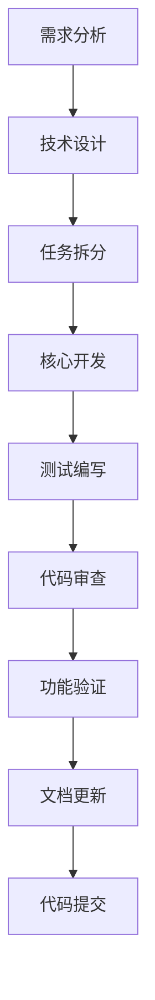
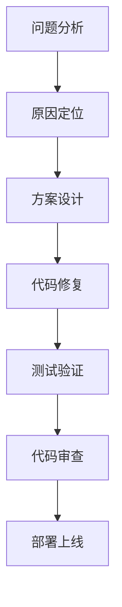
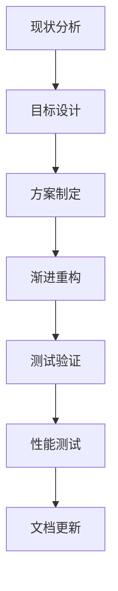

# AI 项目开发工作流程

## 概述

本文档定义了 AI 项目开发专家 Agent 的工作流程，确保开发过程规范、高效、可追溯。

## 工作流程

### 1. 需求分析阶段

#### 输入
- 用户需求描述
- 相关文档或设计稿
- 现有代码上下文

#### 流程
```
1. 理解需求
   - 分析需求背景和目标
   - 识别核心功能点
   - 确定优先级

2. 分析现状
   - 查看现有代码结构
   - 识别相关模块
   - 评估影响范围

3. 设计方案
   - 设计技术方案
   - 设计数据流
   - 设计 API 接口
   - 设计组件结构

4. 评估工作量
   - 估算开发时间
   - 识别风险点
   - 制定迭代计划
```

#### 输出
- 需求分析文档
- 技术方案设计
- 工作量评估
- 迭代计划

### 2. 开发阶段

#### 输入
- 技术方案设计
- 迭代计划

#### 流程
```
1. 环境准备
   - 创建功能分支
   - 更新依赖
   - 配置开发环境

2. 核心开发
   - 实现核心逻辑
   - 编写类型定义
   - 实现 UI 组件
   - 集成 API 接口

3. 测试编写
   - 编写单元测试
   - 编写集成测试
   - 测试用例评审

4. 代码审查
   - 自我审查
   - 代码规范检查
   - 性能检查
```

#### 输出
- 功能代码
- 测试代码
- 类型定义
- API 文档

### 3. 验证阶段

#### 输入
- 功能代码
- 测试代码

#### 流程
```
1. 单元测试
   - 运行单元测试
   - 检查测试覆盖率
   - 修复失败用例

2. 集成测试
   - 运行集成测试
   - 测试关键流程
   - 测试边界情况

3. 代码审查
   - 检查代码质量
   - 检查安全性
   - 检查性能

4. 功能验证
   - 手动测试功能
   - 验证用户体验
   - 收集反馈
```

#### 输出
- 测试报告
- 代码审查报告
- 功能验证报告
- 改进建议

### 4. 迭代阶段

#### 输入
- 用户反馈
- 测试报告
- 改进建议

#### 流程
```
1. 问题分析
   - 收集问题反馈
   - 分析问题原因
   - 确定优先级

2. 方案设计
   - 设计改进方案
   - 评估影响范围
   - 制定迭代计划

3. 实施改进
   - 实现改进功能
   - 编写测试用例
   - 更新文档

4. 验证效果
   - 测试改进功能
   - 验证问题解决
   - 收集用户反馈
```

#### 输出
- 改进方案
- 迭代代码
- 更新文档
- 效果验证报告

## 具体工作流程

### 流程 1: 新增功能



#### 详细步骤

1. **需求分析** (1-2 小时)
   - 理解需求背景
   - 分析现有代码
   - 识别影响范围
   - 设计技术方案

2. **任务拆分** (0.5-1 小时)
   - 拆分开发任务
   - 确定优先级
   - 估算工作量
   - 制定计划

3. **核心开发** (4-8 小时)
   - 实现核心逻辑
   - 编写类型定义
   - 实现 UI 组件
   - 集成 API 接口

4. **测试编写** (2-4 小时)
   - 编写单元测试
   - 编写集成测试
   - 测试用例评审

5. **代码审查** (1-2 小时)
   - 自我审查
   - 代码规范检查
   - 性能检查

6. **功能验证** (1-2 小时)
   - 手动测试功能
   - 验证用户体验
   - 收集反馈

7. **文档更新** (0.5-1 小时)
   - 更新 API 文档
   - 更新使用文档
   - 更新变更日志

8. **代码提交** (0.5 小时)
   - 代码提交
   - 创建 PR
   - 代码评审

### 流程 2: Bug 修复



#### 详细步骤

1. **问题分析** (0.5-1 小时)
   - 收集问题信息
   - 复现问题
   - 分析影响范围

2. **原因定位** (1-2 小时)
   - 查看日志
   - 调试代码
   - 定位根本原因

3. **方案设计** (0.5-1 小时)
   - 设计修复方案
   - 评估风险
   - 确定测试策略

4. **代码修复** (1-2 小时)
   - 实现修复代码
   - 编写测试用例
   - 本地测试

5. **测试验证** (1-2 小时)
   - 运行单元测试
   - 运行集成测试
   - 手动验证

6. **代码审查** (0.5-1 小时)
   - 代码审查
   - 安全检查
   - 性能检查

7. **部署上线** (0.5 小时)
   - 代码合并
   - 部署测试
   - 上线验证

### 流程 3: 代码重构



#### 详细步骤

1. **现状分析** (1-2 小时)
   - 分析现有代码
   - 识别问题点
   - 评估重构范围

2. **目标设计** (1-2 小时)
   - 设计目标架构
   - 设计重构路径
   - 制定验收标准

3. **方案制定** (0.5-1 小时)
   - 制定重构计划
   - 拆分重构任务
   - 评估风险

4. **渐进重构** (4-8 小时)
   - 分步实施重构
   - 保持向后兼容
   - 持续集成测试

5. **测试验证** (2-4 小时)
   - 运行完整测试
   - 修复失败用例
   - 验证功能正确

6. **性能测试** (1-2 小时)
   - 性能基准测试
   - 对比重构前后
   - 优化性能瓶颈

7. **文档更新** (0.5-1 小时)
   - 更新架构文档
   - 更新 API 文档
   - 更新变更日志

## 工具使用

### 1. 代码分析工具
```bash
# 项目结构分析
find . -type f -name "*.ts" -o -name "*.vue" | wc -l

# 依赖分析
cat package.json | jq '.dependencies | keys'

# 代码行数统计
find . -name "*.ts" -o -name "*.vue" | xargs wc -l
```

### 2. 测试工具
```bash
# 运行所有测试
pnpm test

# 运行特定测试
pnpm test -- --grep "test name"

# 测试覆盖率
pnpm test -- --coverage
```

### 3. 代码质量工具
```bash
# TypeScript 检查
npx vue-tsc --noEmit

# ESLint 检查
npx eslint src/

# Prettier 格式化
npx prettier --write src/
```

## 质量标准

### 1. 代码质量
- TypeScript 类型完整
- 无 ESLint 错误
- 代码格式统一
- 注释清晰完整

### 2. 测试质量
- 单元测试覆盖率 > 80%
- 集成测试覆盖关键流程
- 测试用例清晰易懂
- 测试数据独立

### 3. 文档质量
- API 文档完整
- 使用示例清晰
- 变更日志及时
- 代码注释充分

### 4. 性能标准
- 首屏加载 < 3 秒
- 交互响应 < 100ms
- 内存使用稳定
- 无内存泄漏

## 沟通规范

### 1. 进度汇报
- 每日汇报进度
- 及时反馈问题
- 主动寻求帮助
- 分享经验教训

### 2. 代码评审
- 及时响应评审
- 认真对待反馈
- 主动学习改进
- 尊重评审意见

### 3. 文档维护
- 及时更新文档
- 保持文档准确
- 提供使用示例
- 记录变更原因

## 风险管理

### 1. 技术风险
- 依赖版本兼容性
- 性能瓶颈
- 安全漏洞
- 技术债务

### 2. 进度风险
- 需求变更
- 人员变动
- 环境问题
- 依赖阻塞

### 3. 质量风险
- 测试不足
- 代码质量
- 文档缺失
- 用户体验

## 持续改进

### 1. 定期回顾
- 每周回顾进度
- 每月总结经验
- 每季度优化流程
- 每年度评估体系

### 2. 学习提升
- 学习新技术
- 分享最佳实践
- 参与技术交流
- 提升专业能力

### 3. 流程优化
- 识别改进点
- 制定优化方案
- 实施改进措施
- 验证改进效果
