# AI 对话 — 设计稿与交互流

## 一、页面线框（AiChatView）

```
┌──────────────────────────────────────────────────────────────────────────┐
│ 顶栏                                                                      │
│  [AI] 智能助手          ● 已连接   [🕐 历史]   [+ 新对话]                  │
├──────────────────────────────────────────────────────────────────────────┤
│                                                                          │
│  ┌─ TaskChainBar（多步任务时显示）────────────────────────────────────┐  │
│  │ ① 生成页面 ✓  →  ② 生成表单 ●  →  ③ 汇总                            │  │
│  └────────────────────────────────────────────────────────────────────┘  │
│                                                                          │
│  ┌─ 消息区（滚动）────────────────────────────────────────────────────┐  │
│  │  You: 帮我做一个请假审批流程                                        │  │
│  │                                                                      │  │
│  │  Flow Agent                                                          │  │
│  │  ┌─ FlowCard ─────────────────────────────────────────────────┐   │  │
│  │  │  请假审批流程  [开始] [审批] [结束]                            │   │  │
│  │  │  [发布到流程设计器]  [在编辑器中打开]                           │   │  │
│  │  └──────────────────────────────────────────────────────────────┘   │  │
│  │  ▼ 思考过程（可折叠）                                                │  │
│  │  🔧 flow__search  ✓                                                 │  │
│  └────────────────────────────────────────────────────────────────────┘  │
│                                                                          │
├──────────────────────────────────────────────────────────────────────────┤
│  输入区 AiChatPanel                                                       │
│  ┌─ RAG 已选上下文 chips ─────────────────────────────────────────────┐  │
│  │  📄 请假流程规范 ×    📄 Schema 设计指南 ×                          │  │
│  └────────────────────────────────────────────────────────────────────┘  │
│  ┌─ AiMentionInput ─────────────────────────────────────────────────┐  │
│  │  @schema 引用...                                                  │  │
│  └────────────────────────────────────────────────────────────────────┘  │
│  [📎 文档] [🔍 RAG] [⚙ 设置]   Agent: Auto ▼   [编排: 智能助手 ▼]  [发送] │
└──────────────────────────────────────────────────────────────────────────┘
```

### 关键组件

| 组件 | 职责 |
|------|------|
| `AiChatPanel` | 消息列表 + 输入区容器 |
| `AiMessage` | 单条消息：文本、思考、工具调用、卡片 |
| `TaskChainBar` | 多 Agent 任务链进度 |
| `AiMentionInput` | @ 引用 Schema/Flow |
| `AiRagSearch` | 输入区上方 RAG 检索浮层 |
| `AgentWorkflowPicker` | 选择已发布工作流作为后端 |
| `RequirementConfirmCard` | 需求确认 HITL 卡片 |
| `ConversationDrawer` | 对话历史侧抽屉 |
| `AiChatSettings` | 设置抽屉（模型、工作流、健康检查） |

---

## 二、对话后端选择

用户可在设置或输入区选择对话引擎：

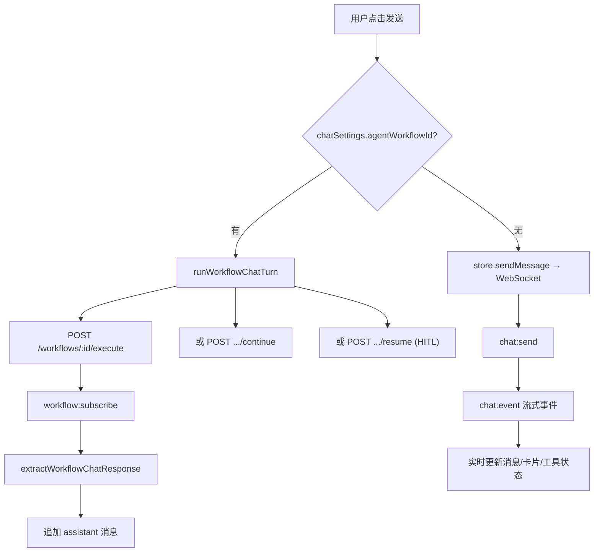

| 模式 | 传输 | 流式 | HITL |
|------|------|------|------|
| LangGraph（默认） | WebSocket | ✅ 逐字/事件 | `interrupt` + `chat:resume` |
| 已发布工作流 | WebSocket + REST 启动 | ✅ `workflow:event` | `waiting` + resume API |

---

## 三、LangGraph 对话交互流

### 3.1 标准生成流程

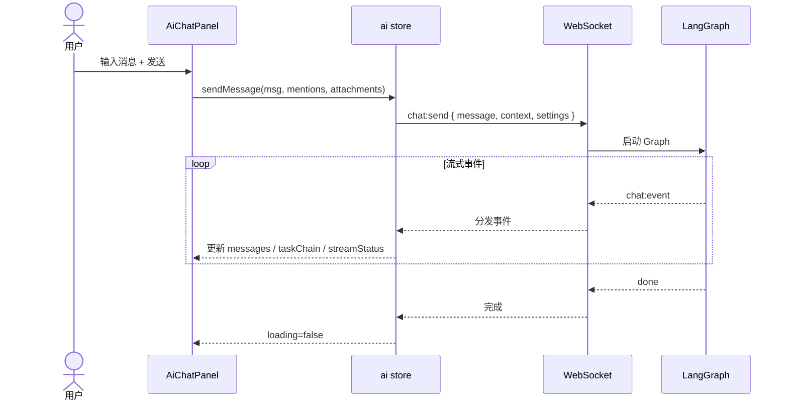

### 3.2 v2 需求确认（HITL）

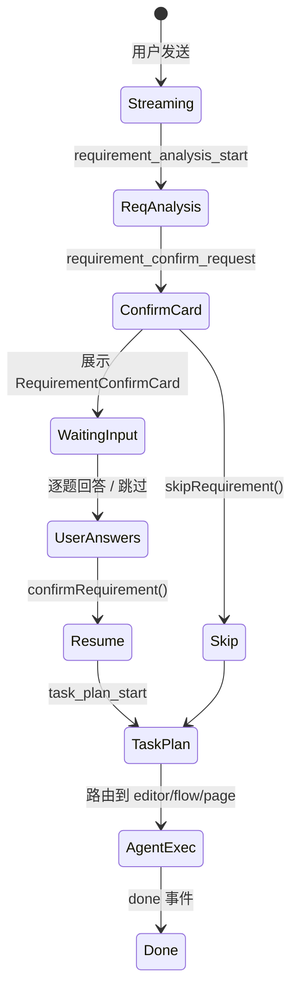

**RequirementConfirmCard 交互**：

```
┌─ 需求确认 ─────────────────────────────────────────┐
│  问题 1/3：审批需要几级？                            │
│  ○ 一级   ● 二级   ○ 三级                          │
│  [上一题]  [下一题]  [跳过全部]  [确认并继续]         │
└────────────────────────────────────────────────────┘
```

确认后输入框 placeholder 变为 `requirementInputPlaceholder` 提示。

### 3.3 任务链（多 Agent 协作）

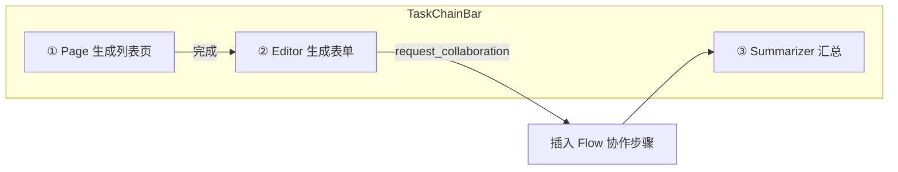

`CollaborationBar` 在 Agent 切换时短暂显示协作来源。

### 3.4 Schema / Flow 卡片操作

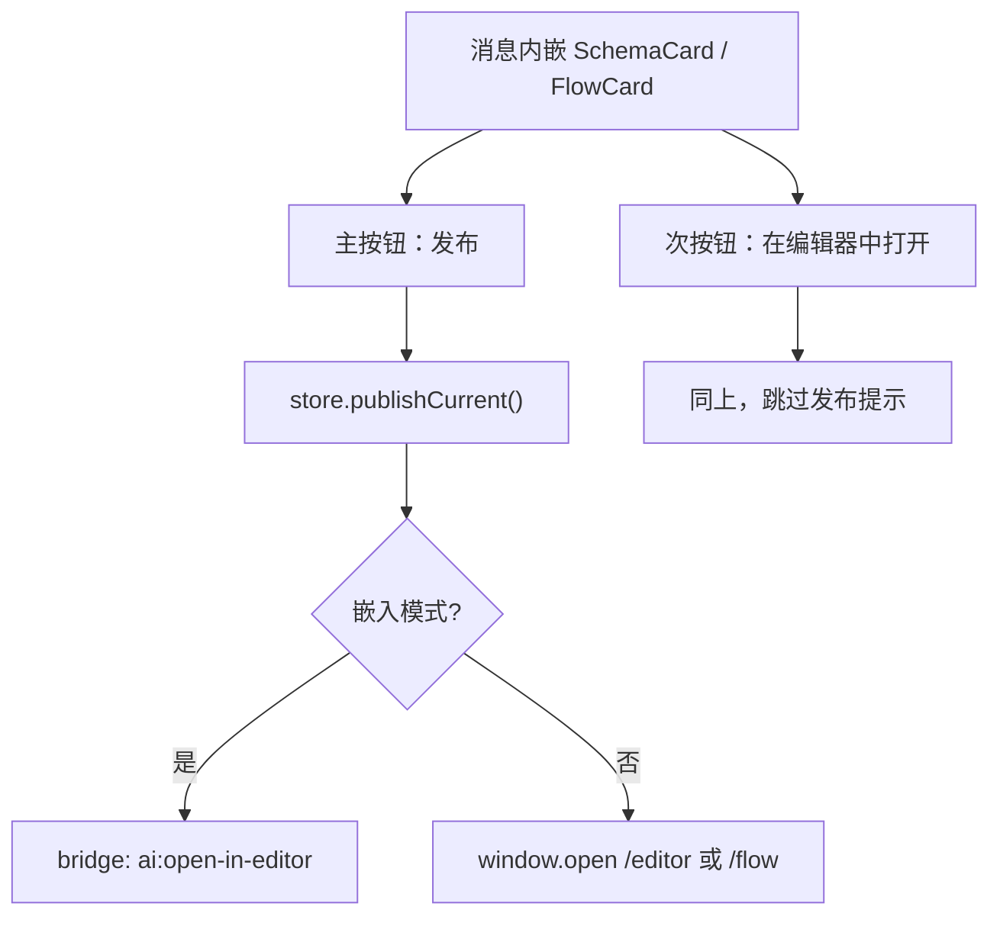

---

## 四、工作流模式对话交互流

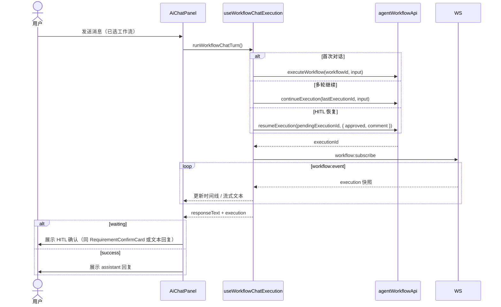

**输入 payload 映射**（含文档附件时）：

```
input.message          ← 用户文本
input.documentId       ← 首个附件 ID
input.documentIds      ← 全部附件 ID
input.documentAttachments
input.file             ← 工作流文件引用
```

---

## 五、输入区功能交互

### 5.1 文档附件

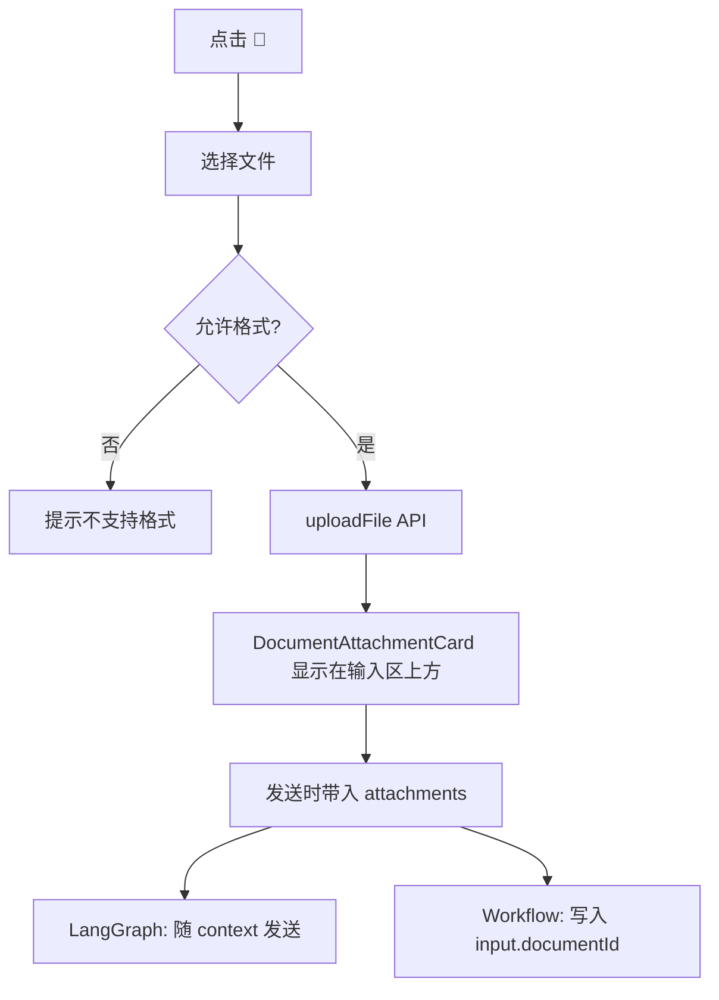

支持格式见 `@schema-platform/ai-shared/document` 的 `DOCUMENT_UPLOAD_ACCEPT`。

### 5.2 内联 RAG 检索

```
点击 [🔍 RAG]
    ↓
┌─ AiRagSearch 浮层 ─────────────────────┐
│  搜索: [请假流程____________] [搜索]     │
│  ─────────────────────────────────────  │
│  ○ 请假审批规范 (score 0.92)            │
│  ○ 流程节点说明 (score 0.85)            │
└─────────────────────────────────────────┘
    ↓ 选择
RAG chip 出现在输入区上方 → 发送时作为 ragContext 注入
```

### 5.3 @ Mention 引用

`AiMentionInput` 输入 `@` 触发 Schema/Flow 搜索，选中后作为 `mentions` 随消息发送，供 Agent 精确定位上下文。

### 5.4 设置抽屉

```
┌─ 对话设置 (320px Drawer) ──────────────┐
│ ▼ 连接状态                              │
│   ● API Key 已配置                      │
│   DeepSeek deepseek-chat [默认]         │
│ ▼ 模型                                  │
│   对话模型: [DeepSeek Chat ▼]           │
│ ▼ Agent 编排                            │
│   [选择已发布工作流 ▼]                   │
│   留空则使用 LangGraph 对话引擎          │
│ [取消]  [保存]                          │
└─────────────────────────────────────────┘
```

---

## 六、消息组件状态

### 6.1 Assistant 消息结构

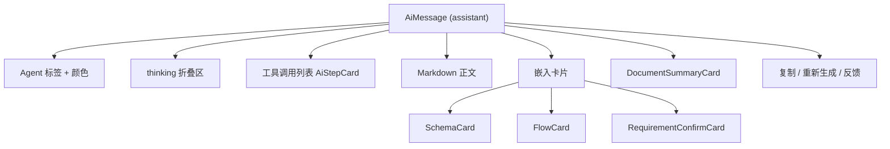

### 6.2 流式连接状态

| streamStatus | UI 表现 |
|--------------|---------|
| `idle` | 正常 |
| `connecting` | 发送按钮禁用，显示连接中 |
| `streaming` | 显示停止按钮，消息逐字更新 |
| `reconnecting` | 显示重试计数 `retryCount / MAX_AUTO_RETRIES` |
| `error` | 显示重试按钮 |

顶栏 WS 指示灯：`isConnected()` 每秒轮询，绿点=已连接。

---

## 七、对话历史

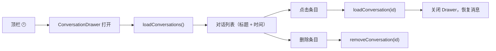

---

## 八、空状态与错误

| 场景 | 表现 |
|------|------|
| 新对话 | 空消息区 + 欢迎提示 |
| WS 断开 | 顶栏红点「未连接」，发送可能失败 |
| 对话 404 | Toast「对话不存在或已被删除」，刷新列表 |
| 工作流执行失败 | assistant 消息展示 error 文本 |
| 工具调用失败 | AiStepCard 红色状态 + 重试按钮 |

---

## 九、运行时架构

> 完整运行时图见 [runtime.md](./runtime.md)

### LangGraph 请求链路

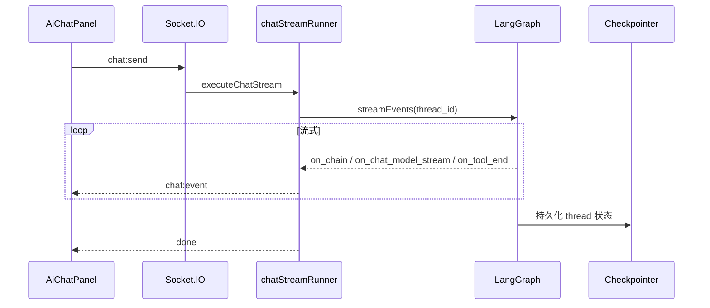

### 双后端运行时分支

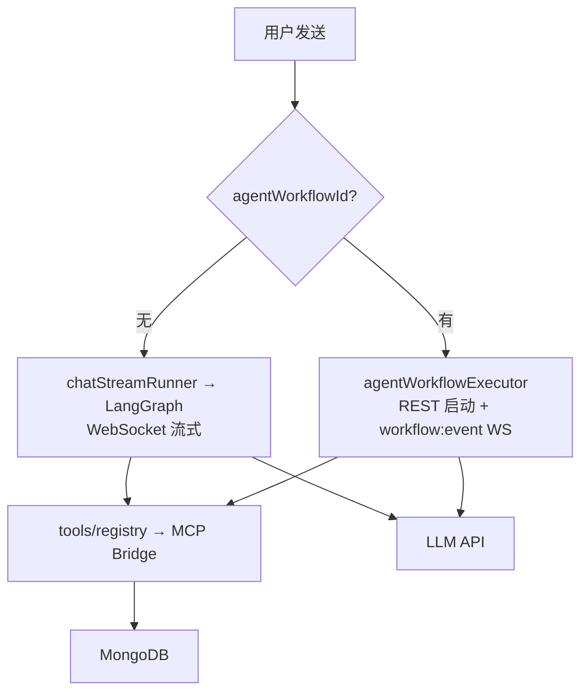

