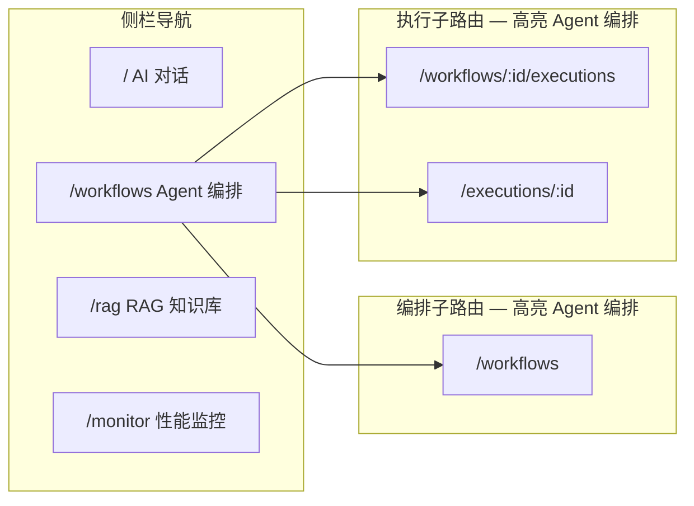
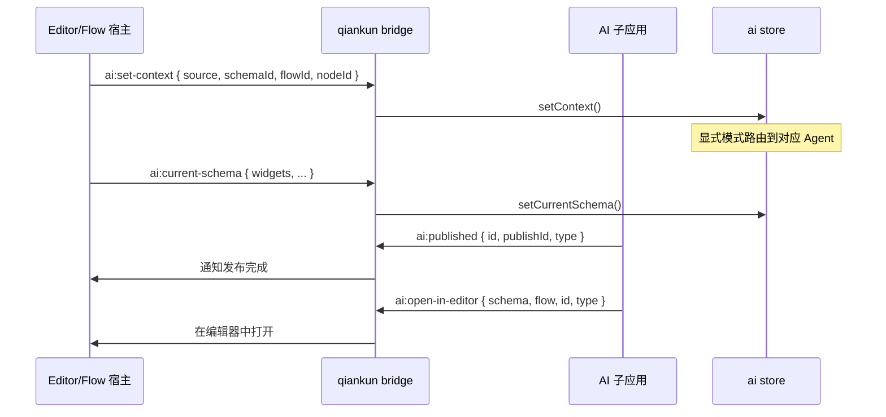
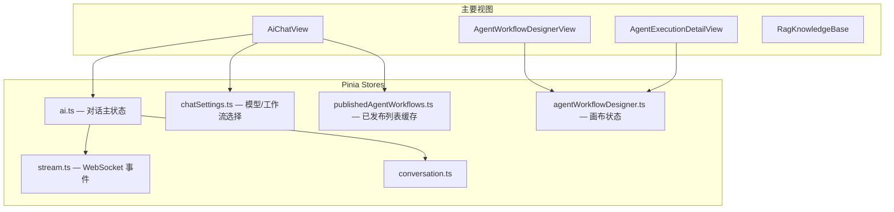
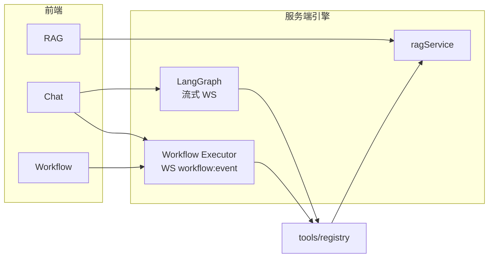

# 信息架构与布局

## 一、应用壳层

### 1.1 独立模式线框

```
┌──────────────────────────────────────────────────────────────────────────┐
│ AiLayout                                                                 │
├────────────┬─────────────────────────────────────────────────────────────┤
│  侧栏 200px │  主内容区 (router-view)                                    │
│            │                                                             │
│  [AI Logo] │                                                             │
│  智能助手   │                                                             │
│ ────────── │                                                             │
│ ● AI 对话  │                                                             │
│   Agent编排│                                                             │
│   RAG知识库│                                                             │
│   性能监控 │                                                             │
│ ────────── │                                                             │
│   侧边栏模式│                                                             │
└────────────┴─────────────────────────────────────────────────────────────┘
```

### 1.2 qiankun 嵌入模式

Shell 已提供主导航时，子应用隐藏左侧栏，主内容区占满宽度：

```
┌──────────────────────────────────────────────────────────────────────────┐
│ Shell 顶栏 / 菜单                                                         │
├──────────────────────────────────────────────────────────────────────────┤
│                                                                          │
│                    AI 子应用主内容（100% 宽）                              │
│                                                                          │
└──────────────────────────────────────────────────────────────────────────┘
```

嵌入检测：`useShellEmbed().shouldHideSubAppMenu`

### 1.3 全屏页面（脱离 AiLayout 侧栏）

设计器与执行详情为独立全屏路由，自带顶栏工具条：

| 路由 | 布局 |
|------|------|
| `/workflows/:id` | 顶栏 Toolbar + 三栏设计器 |
| `/executions/:id` | 顶栏状态条 + 画布 + 底/侧面板 |

---

## 二、路由与导航高亮



`activeNav` 规则：`/workflows*` 与 `/executions*` 均激活「Agent 编排」。

---

## 三、嵌入集成（editor / flow）

### 3.1 Bridge 事件



### 3.2 侧边栏模式 (`/sidebar`)

400px 宽精简 Chat，嵌入 editor/flow 右侧面板：

```
┌──────────────────────────────┐ 400px
│ 上下文条  [Schema ▼] [Node]   │
│ WS ● 已连接    [历史] [编排▼] │
├──────────────────────────────┤
│                              │
│   消息列表（无预览面板）        │
│                              │
├──────────────────────────────┤
│  Agent: Auto ▼               │
│  ┌────────────────────────┐  │
│  │ 输入消息...             │  │
│  └────────────────────────┘  │
│  [附件] [RAG] [发送]          │
└──────────────────────────────┘
```

与全屏 Chat 差异：

| 能力 | 全屏 Chat | 侧边栏 |
|------|-----------|--------|
| 对话历史 | 右侧 Drawer | Popover |
| 预览面板 | 无（单栏） | 无 |
| 上下文条 | 无 | 有（Schema/Flow/Node） |
| 发布跳转 | 新窗口打开 editor/flow | bridge 通知宿主 |

---

## 四、色彩与 Agent 标识

| Agent | 用途 | 消息标签色 |
|-------|------|-----------|
| `auto` / router | 自动路由 | 默认蓝 |
| `editor` | 表单 | 绿系 |
| `flow` | 流程 | 橙系 |
| `page` | 页面 | 紫系 |
| `general` | 通用 | 灰系 |

工作流节点颜色见 `constants/agentNodes.ts` 的 `AGENT_NODE_COLORS`。

---

## 五、全局状态 Store 关系



---

## 六、运行时总览



详见 [runtime.md](./runtime.md)。

