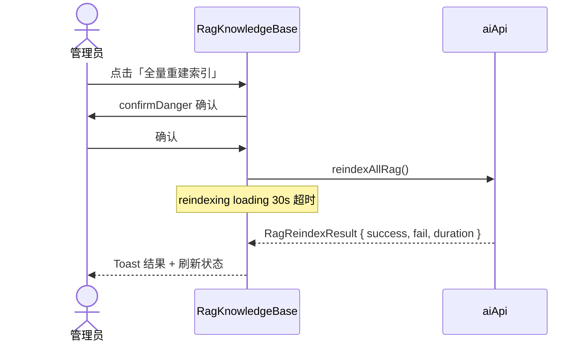
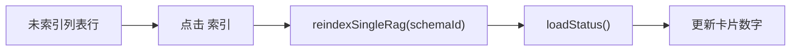
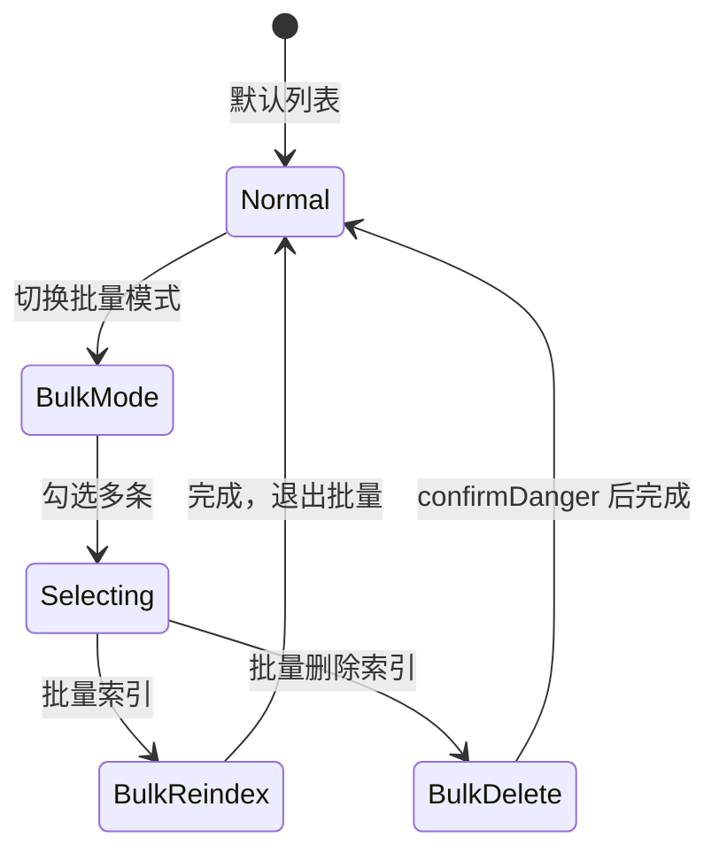
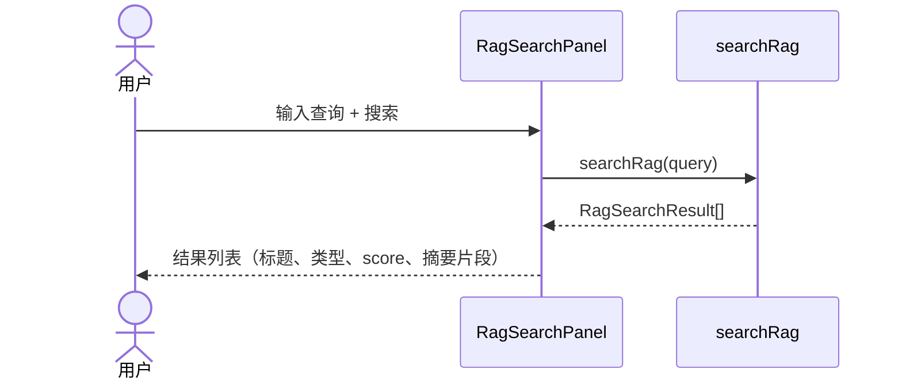
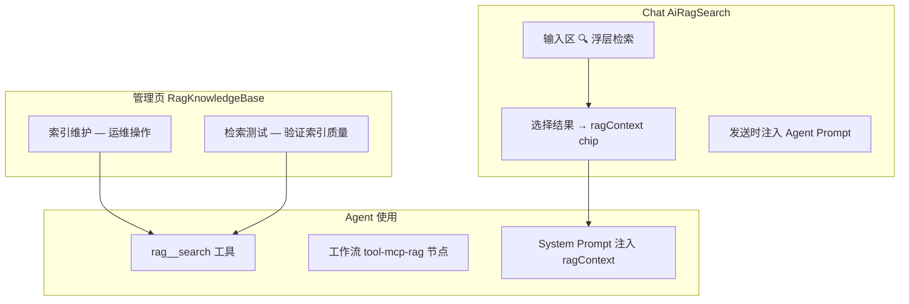
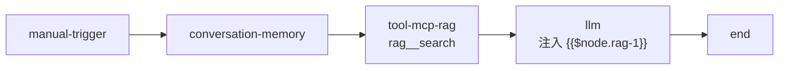
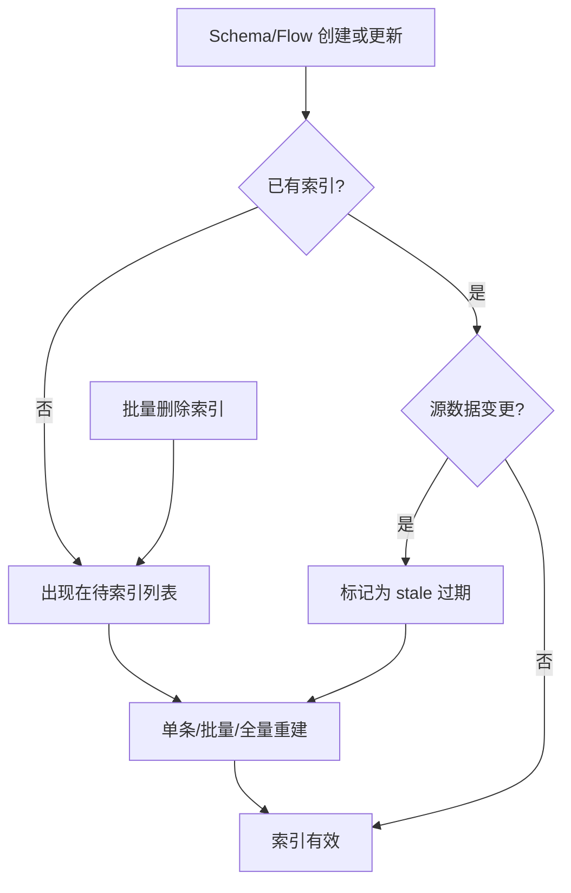
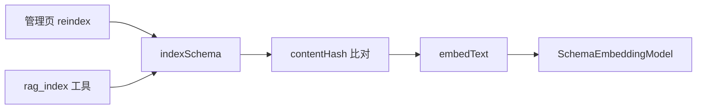
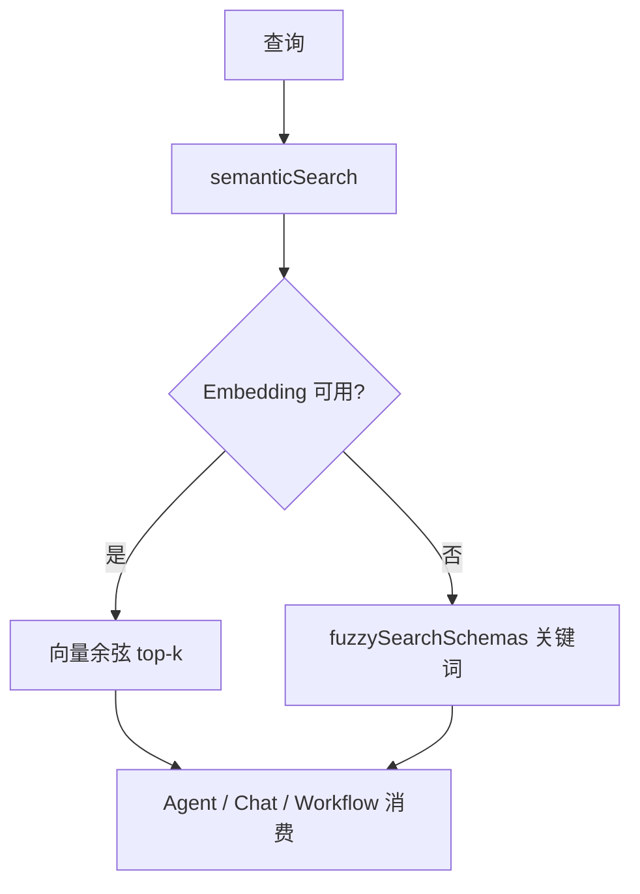

# RAG 知识库 — 设计稿与交互流

## 一、页面线框（RagKnowledgeBase）

布局对齐性能监控：Dashboard 顶栏 + 摘要卡片 + 双列面板 + 全宽表格。

```
┌──────────────────────────────────────────────────────────────────────────┐
│ RAG 知识库                          [全量重建索引]  [刷新状态]             │
├──────────────────────────────────────────────────────────────────────────┤
│ ┌──────┐ ┌──────┐ ┌──────┐ ┌──────┐ ┌──────┐ ┌──────┐                   │
│ │流程   │ │Schema│ │已索引 │ │待索引 │ │过期   │ │覆盖率 │  ← RagSummary   │
│ │  42  │ │  128 │ │  150 │ │   20 │ │   3  │ │  88% │                   │
│ └──────┘ └──────┘ └──────┘ └──────┘ └──────┘ └──────┘                   │
├──────────────────────────────┬───────────────────────────────────────────┤
│  RagSearchPanel              │  RagIndexOverview                         │
│  ┌────────────────────────┐  │  未索引 Schema 列表                        │
│  │ 🔍 检索测试             │  │  [批量模式] [批量索引] [批量删除索引]        │
│  │ [请假流程________] [搜索]│  │  ┌────────────────────────────────────┐  │
│  └────────────────────────┘  │  │ ☐ 用户注册表单    schema-001  [索引] │  │
│  检索结果:                    │  │ ☐ 请假申请表      schema-002  [索引] │  │
│  ┌────────────────────────┐  │  │ ...                                │  │
│  │ 请假审批规范  score 0.92│  │  └────────────────────────────────────┘  │
│  │ schema / 表单设计指南 ... │  │  分页: < 1 2 3 >                         │
│  └────────────────────────┘  │                                           │
├──────────────────────────────┴───────────────────────────────────────────┤
│  最近重建结果（如有）: 成功 150 / 失败 2 / 耗时 45s                        │
└──────────────────────────────────────────────────────────────────────────┘
```

---

## 二、数据指标说明

| 指标 | 来源字段 | 含义 |
|------|----------|------|
| 流程总数 | `totalFlows` | 平台流程数量 |
| Schema 总数 | `totalSchemas` | 平台表单数量 |
| 已索引 | `indexed` + `indexedFlows` | 已建立向量索引的资源 |
| 待索引 | `unindexed` | 尚未索引的 Schema |
| 过期索引 | `stale` | 源数据变更后需重建的索引 |
| 覆盖率 | 计算值 | `(indexed) / (total) * 100%` |

覆盖率颜色：≥90% 绿、≥50% 黄、<50% 红。

---

## 三、索引管理交互流

### 3.1 全量重建



### 3.2 单条索引



### 3.3 批量操作



批量删除调用 `deleteRagEmbedding(id)`，仅删除向量索引，不删除源 Schema。

---

## 四、检索测试交互流

管理页左侧 `RagSearchPanel` 用于验证索引质量：



结果项结构（`RagSearchResult`）：

| 字段 | 展示 |
|------|------|
| `title` | 主标题 |
| `type` | schema / flow / document |
| `score` | 相关度 0-1 |
| `snippet` | 匹配片段预览 |
| `id` | 资源 ID |

---

## 五、Chat 内联 RAG 交互

Chat 中的 RAG 与管理页共享同一检索 API，但交互场景不同：



### Chat 内联 RAG 线框

```
输入区上方（发送前）:
┌─ 已选知识 ─────────────────────────────────────┐
│  📄 请假审批规范 (0.92) ×   📄 表单设计指南 ×   │
└────────────────────────────────────────────────┘

点击 [🔍 RAG] 弹出:
┌─ 知识库检索 ───────────────────────────────────┐
│  [搜索关键词________________] [搜索]            │
│  ─────────────────────────────────────────────  │
│  + 请假审批规范        schema   0.92           │
│  + 流程节点配置说明    flow     0.85           │
│  （点击 + 加入已选）                            │
└────────────────────────────────────────────────┘
```

Store 方法：

| 操作 | 方法 |
|------|------|
| 搜索 | `searchRagAction(query)` |
| 添加 | `addRagContext(item)` |
| 移除 | `removeRagContext(id)` |

---

## 六、工作流中的 RAG

「智能助手问答」模板内置 RAG 节点：



LLM Prompt 模板：

```
知识库检索结果：{{$node.rag-1}}
当前问题：{{$input.message}}
对话历史：{{$conversation}}
```

---

## 七、索引生命周期



---

## 八、错误与空状态

| 场景 | UI 表现 |
|------|---------|
| 状态加载中 | 摘要卡片显示骨架/loading |
| 加载超时 15s | `useDataLoading` 超时提示 |
| 全量重建失败 | Toast 错误 + `lastReindexResult` 展示失败数 |
| 检索无结果 | RagSearchPanel「未找到相关内容」 |
| 待索引为空 | 列表空状态 + 覆盖率 100% 绿色 |
| 批量操作部分失败 | `索引 N 个成功，M 个失败` warning |

---

## 九、与 MCP 的关系

```
RagKnowledgeBase (管理 UI)
        │
        ▼
   aiApi.reindex* / searchRag
        │
        ▼
   server RAG 服务
        │
        ▼
   MCP ragServer → rag__search
        │
        ▼
   LangGraph / Workflow 工具调用
```

管理页负责**索引运维**；Agent 运行时通过 `rag__search` 工具或 Chat `ragContext` **消费**索引。

---

## 十、运行时架构

> 完整运行时图见 [runtime.md](./runtime.md)

### 索引运行时



### 检索运行时



