# 运行时架构图

> 服务端执行路径、数据流、状态持久化 — 与 UI 交互流（[chat](./chat.md) / [workflows](./workflows.md) / [rag](./rag.md)）对照阅读

---

## 一、平台运行时总览

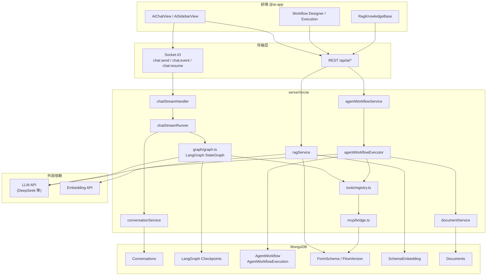

### 双引擎运行时对比

| 维度 | Chat LangGraph | Agent Workflow |
|------|----------------|----------------|
| 入口 | `chat:send` / HTTP SSE | `POST .../execute` / Webhook |
| 编排 | `graph.streamEvents()` | `executeAgentWorkflow()` while 循环 |
| 状态 | Checkpointer + threadId | `AgentWorkflowExecution.nodeRecords` |
| 输出 | 流式 `chat:event` | 轮询 GET execution |
| 取消 | `graphAbort.abort()` | execution `cancelled` |
| HITL | `interrupt` + `chat:resume` | `hitl` 节点 + `POST .../resume` |

---

## 二、Chat LangGraph 运行时

### 2.1 请求处理链路

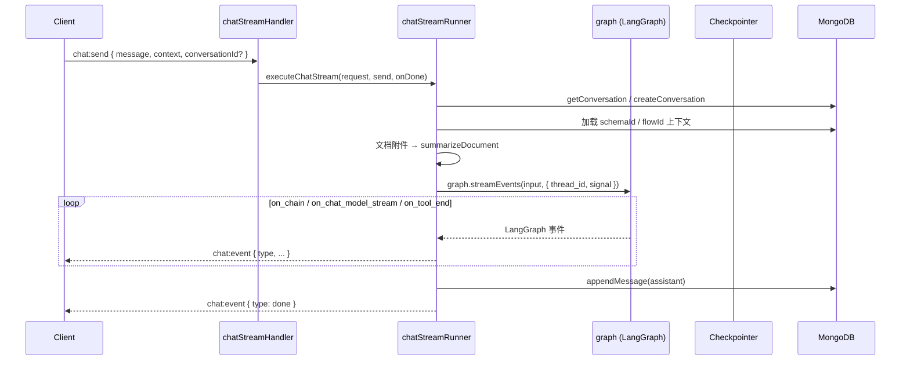

**共用核心**：`chatStreamRunner.executeChatStream` 同时服务 WebSocket 与 HTTP SSE，仅 `send` 回调不同。

### 2.2 LangGraph 编译图（运行时节点）

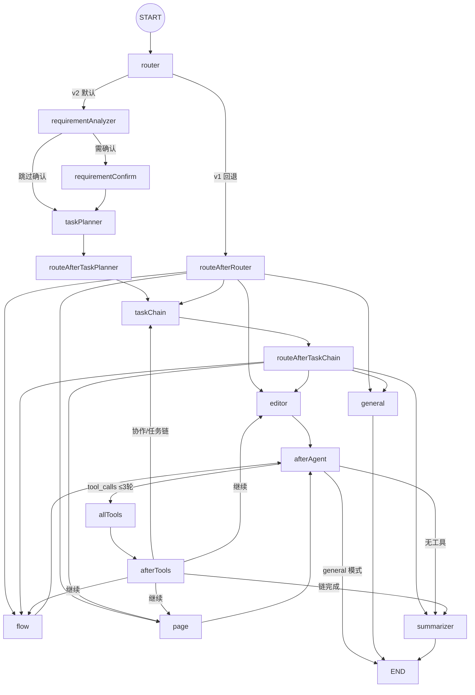

**环境开关**（`graph.ts` `V2_CONFIG`）：

- `AI_ENABLE_REQUIREMENT_ANALYSIS !== 'false'` → v2 管线
- `AI_ENABLE_TASK_PLANNER !== 'false'` → 启用 taskPlanner

### 2.3 streamEvents → 前端事件映射

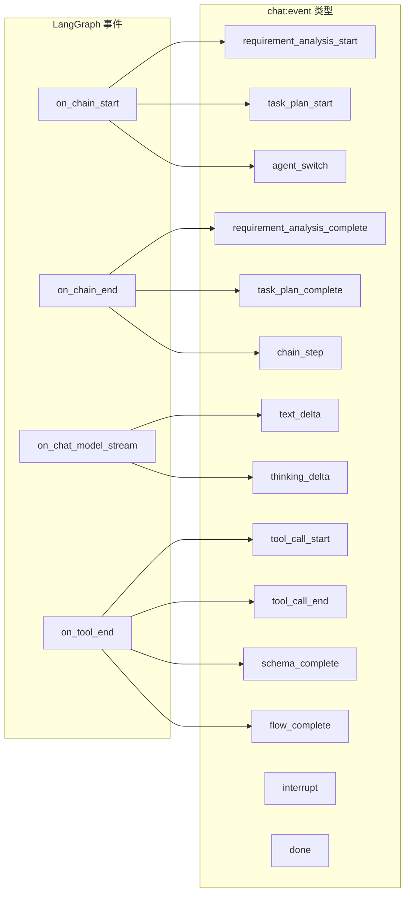

### 2.4 工具调用运行时

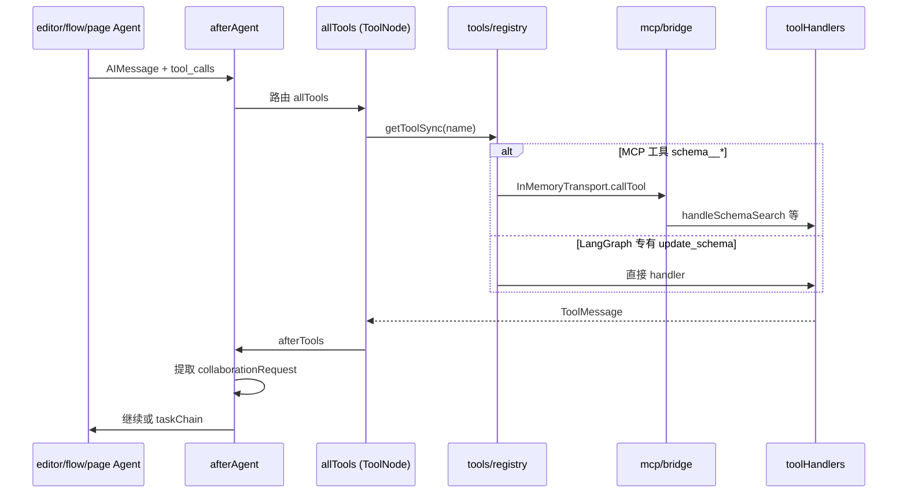

**限制**：
- `afterAgent`：单轮最多 3 次 tool iteration（`MAX_TOOL_ITERATIONS`）
- `router`：`session.maxNodeExecutions` 全局节点上限

### 2.5 Checkpoint 与 HITL Resume

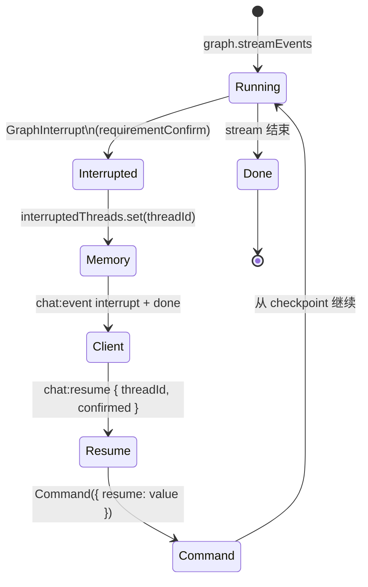

| 存储 | 内容 |
|------|------|
| MongoDB Checkpointer | LangGraph thread 状态（生产必选） |
| `interruptedThreads` Map | 内存中 HITL 中断元数据 |
| Conversations | 消息历史、schema/flow 版本 |

---

## 三、Agent Workflow 运行时

### 3.1 触发与异步执行

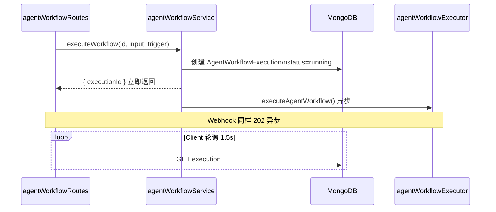

### 3.2 执行器主循环

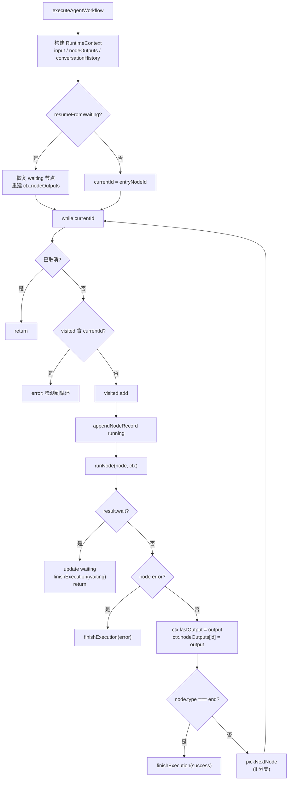

### 3.3 RuntimeContext 数据流

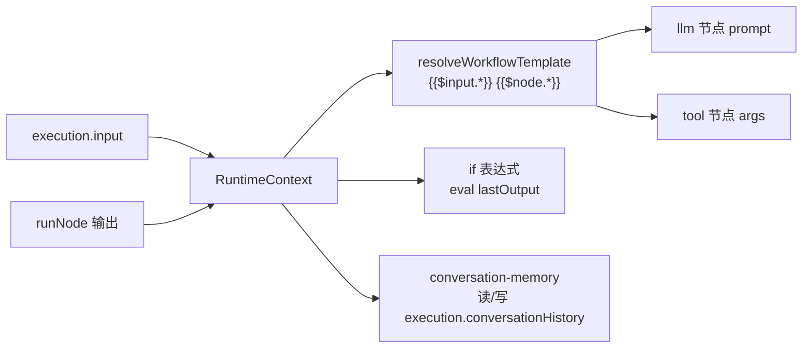

### 3.4 节点分发（runNode）

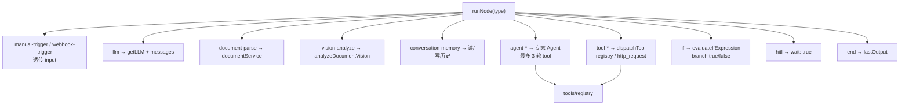

### 3.5 Chat 触发工作流运行时

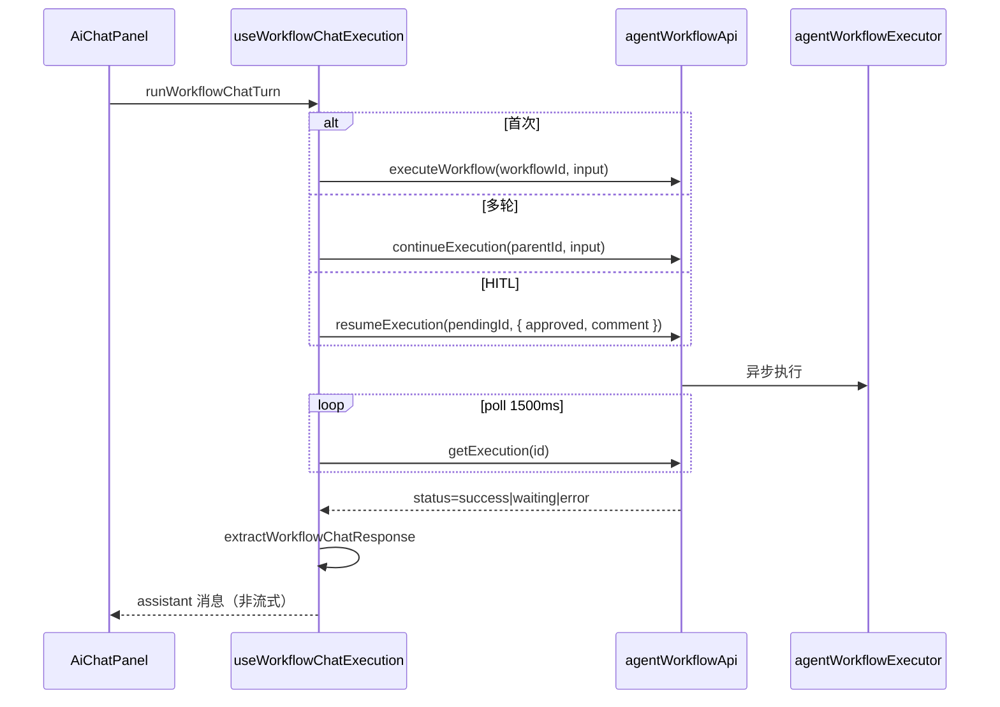

---

## 四、RAG 运行时

### 4.1 索引管道

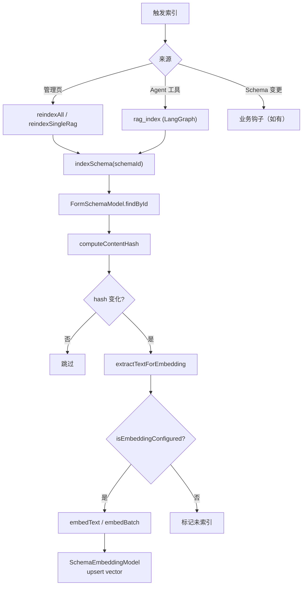

### 4.2 检索管道

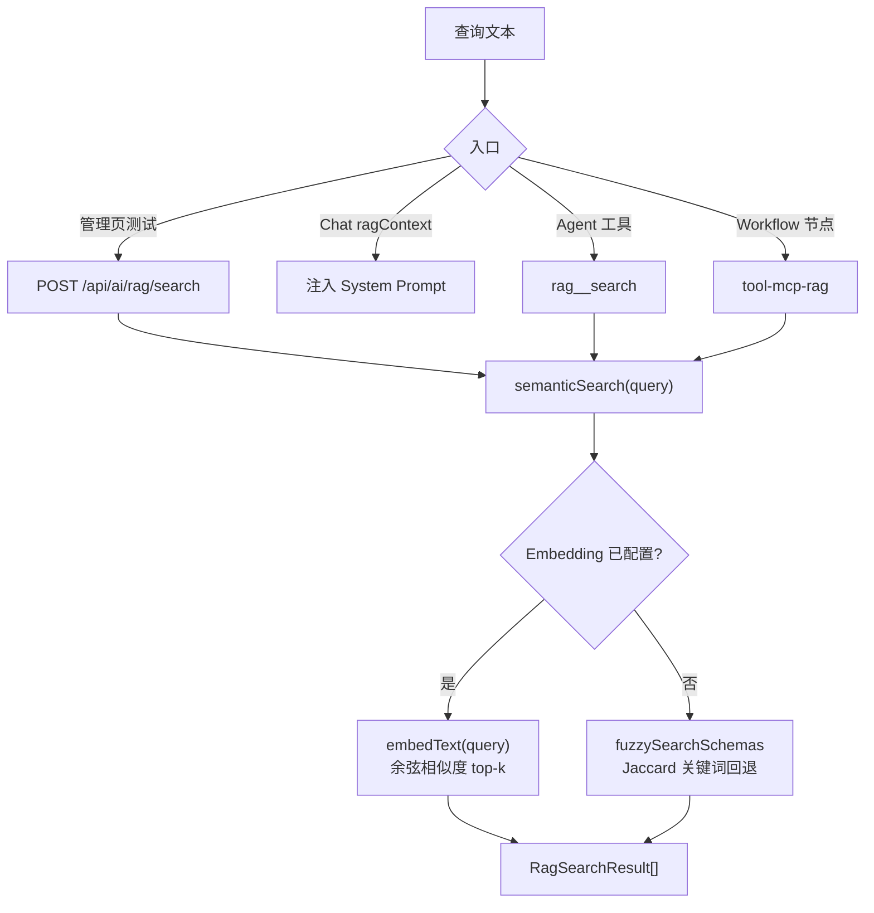

### 4.3 RAG 在 Chat Agent 中的运行时位置

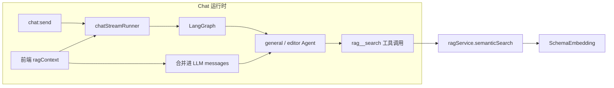

---

## 五、工具注册表启动时序

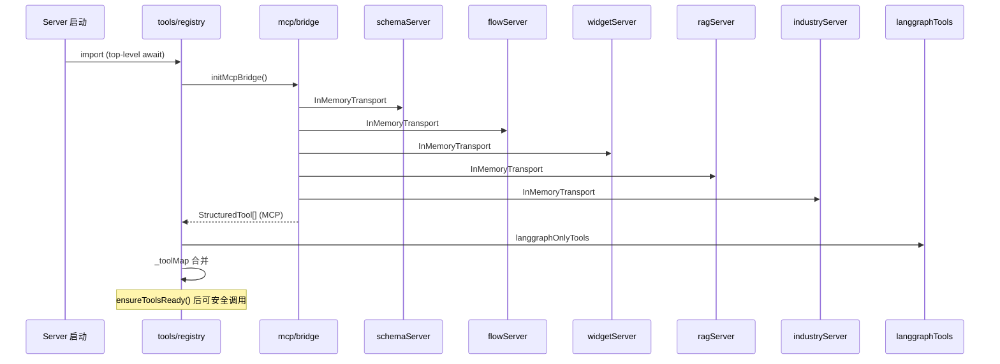

**降级**：MCP 桥接完全失败时退化为仅 `langgraphOnlyTools`，Chat 仍可运行（无 MCP 读取能力）。

---

## 六、文档管道运行时

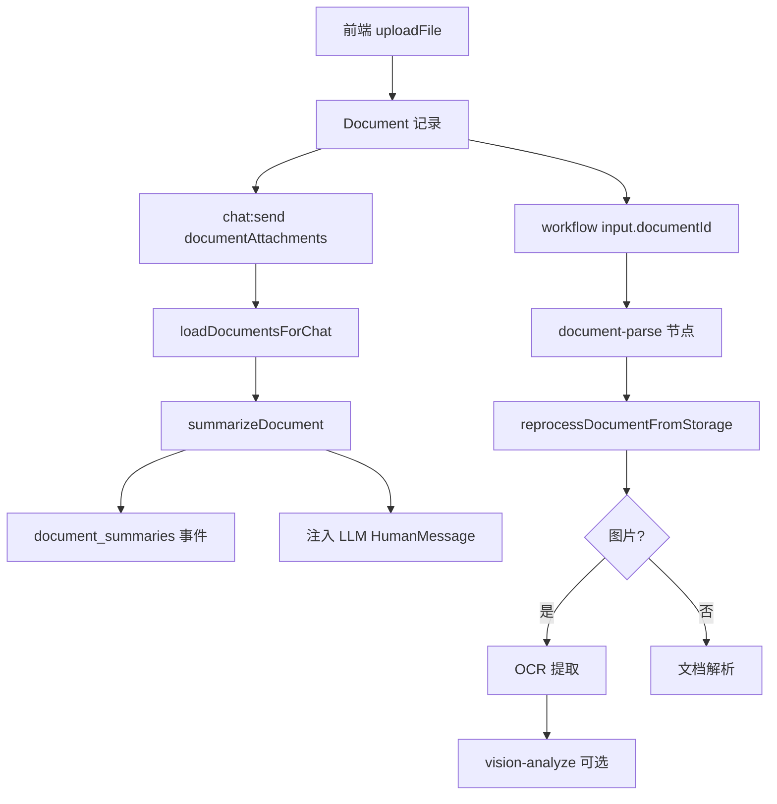

---

## 七、监控运行时（AiMonitorView）

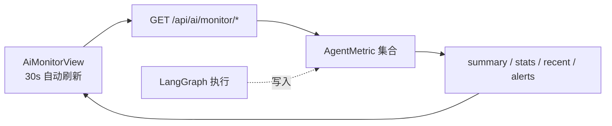

监控采集点在 LangGraph / Agent 执行期间写入 `AgentMetric`，与 Workflow 执行记录（`AgentWorkflowExecution`）**分离存储**。

---

## 八、关键运行时约束速查

| 约束 | 值 | 位置 |
|------|-----|------|
| Agent 单轮 tool 上限 | 3 | `graph.ts` afterAgent |
| Workflow 专家节点 tool 上限 | 3 | agentWorkflowExecutor |
| LangGraph recursionLimit | 30 | chatStreamRunner |
| Workflow 轮询间隔 | 1500ms | useWorkflowChatExecution |
| 版本快照上限 | 20 | agentWorkflowService |
| MCP 工具失败 | 返回 recoverable JSON | mcp/bridge |
| RAG 无 Embedding | 关键词 Jaccard 回退 | ragService |
| Checkpointer 生产 | 必须 MongoDB | checkpointer.ts |

---

## 九、相关文档

| 文档 | 侧重 |
|------|------|
| [chat.md](./chat.md) | Chat UI 交互流 |
| [workflows.md](./workflows.md) | Workflow UI 交互流 |
| [rag.md](./rag.md) | RAG UI 交互流 |
| [../architecture.md](../architecture.md) | 架构说明 |
| [../agent-workflow.md](../agent-workflow.md) | 工作流 API 与节点 |
| [../events.md](../events.md) | 事件协议 |
