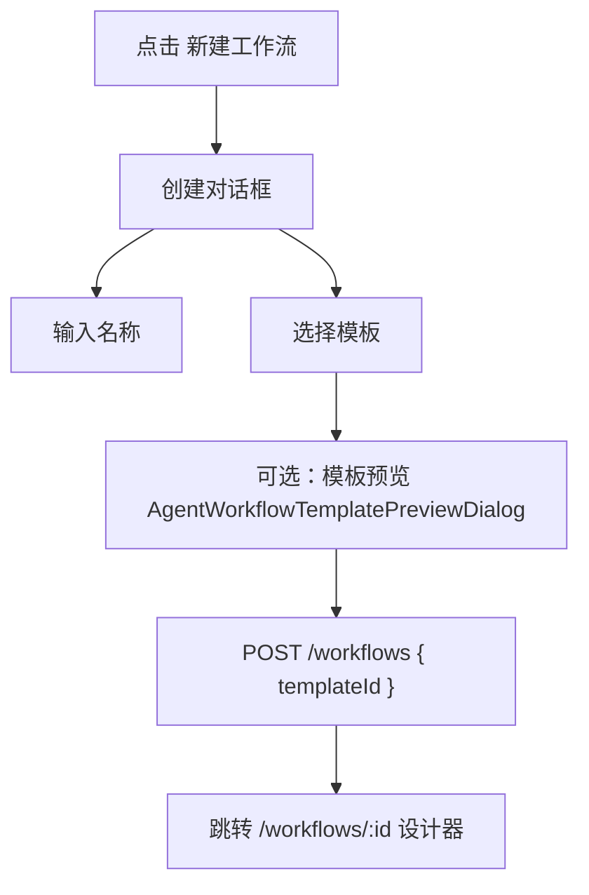
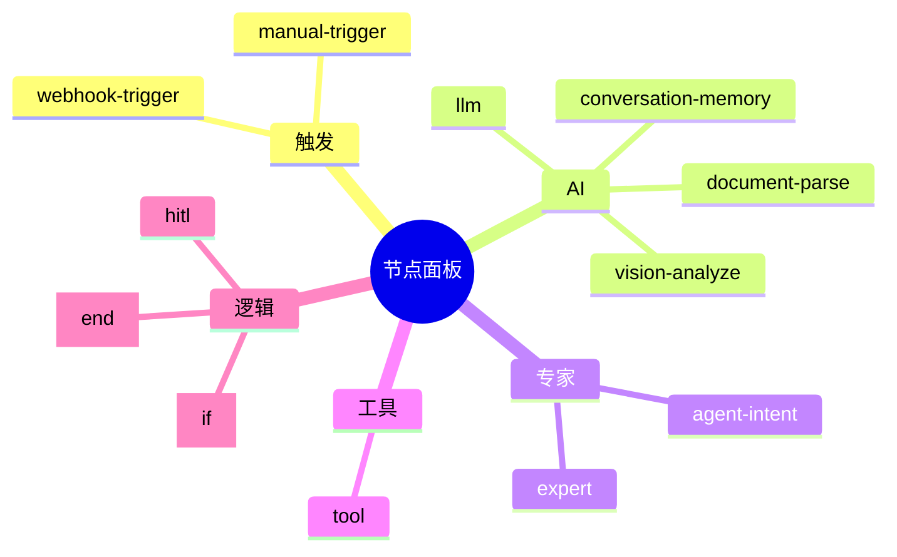
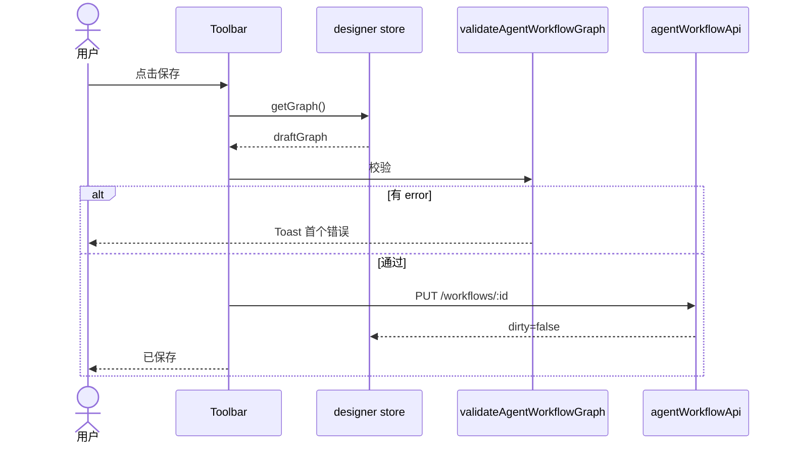
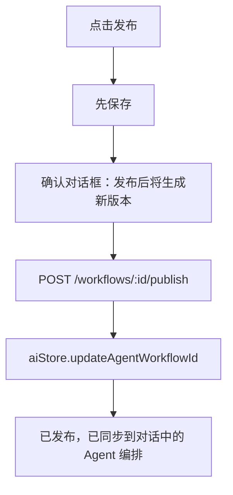
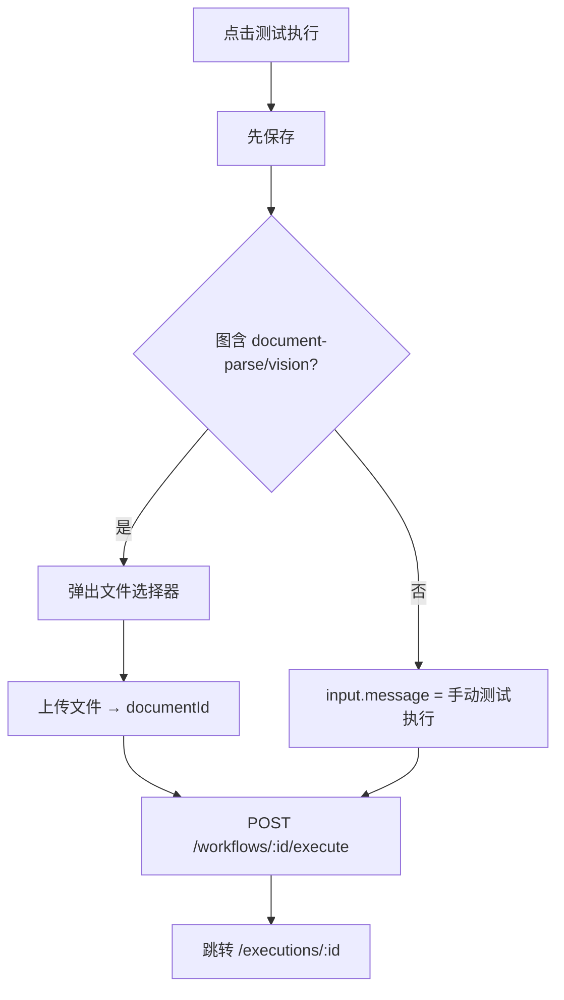
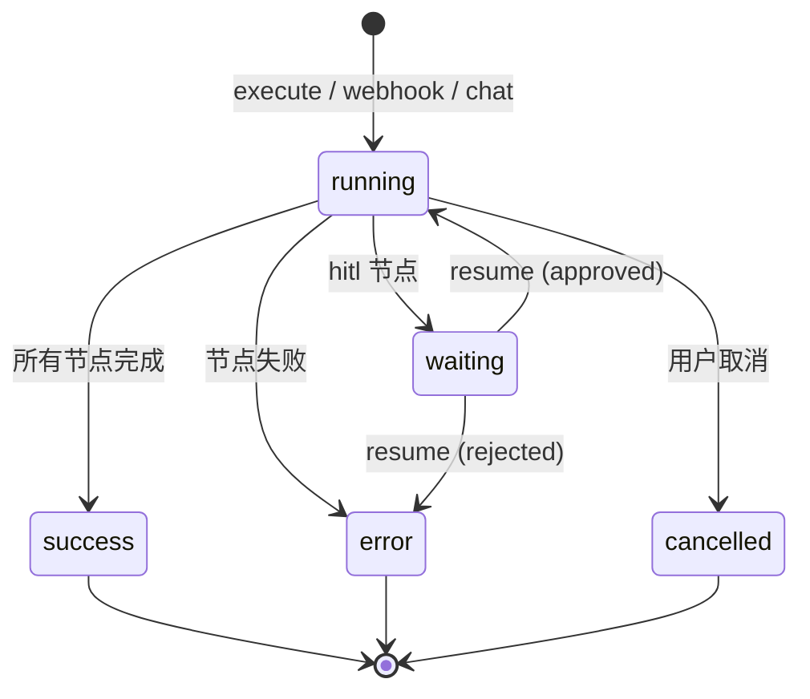
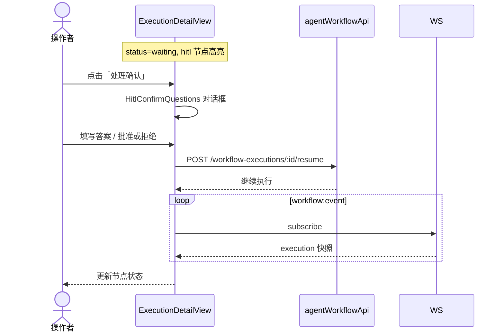
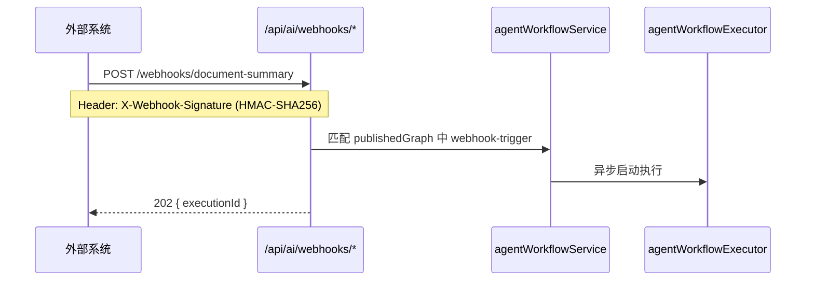
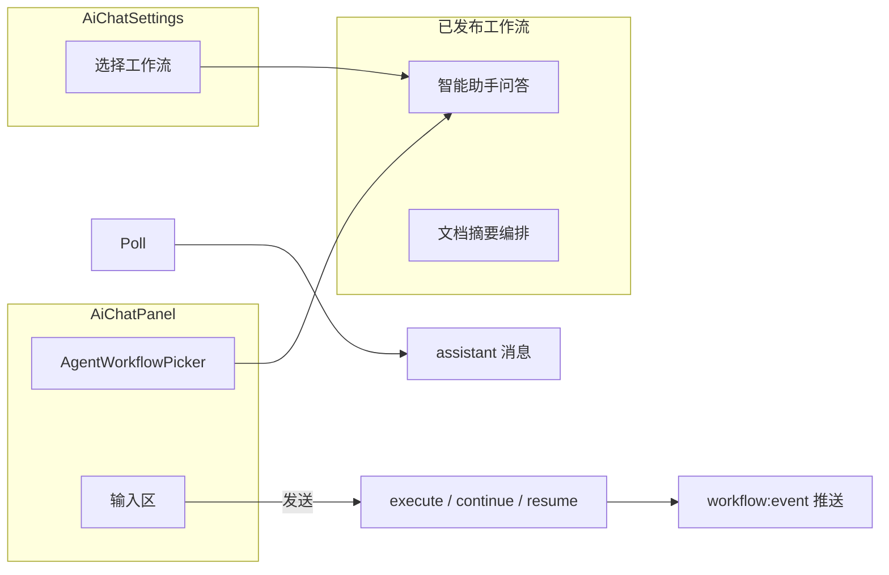
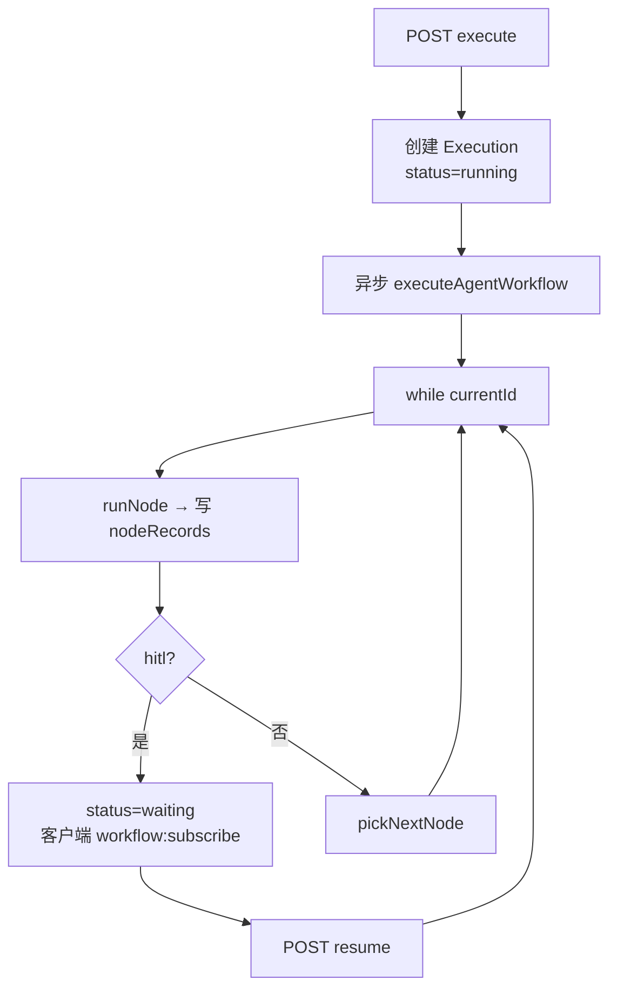

# Agent 编排 — 设计稿与交互流

## 一、列表页线框（AgentWorkflowListView）

```
┌──────────────────────────────────────────────────────────────────────────┐
│ Agent 编排                                    [+ 新建工作流]              │
├──────────────────────────────────────────────────────────────────────────┤
│ [全部] [草稿] [已发布] [模板]          🔍 搜索...    排序: [最近更新 ▼]    │
├──────────────────────────────────────────────────────────────────────────┤
│                                                                          │
│  ┌─────────────────┐  ┌─────────────────┐  ┌─────────────────┐          │
│  │ 📋 文档摘要编排   │  │ 🤖 智能助手问答   │  │ 📝 我的工作流     │          │
│  │ 已发布 v2026...  │  │ 草稿             │  │ 草稿             │          │
│  │ 更新于 2小时前    │  │ 更新于 昨天       │  │ 更新于 3天前      │          │
│  │ [设计] [发布]     │  │ [设计] [发布]     │  │ [设计] [删除]     │          │
│  └─────────────────┘  └─────────────────┘  └─────────────────┘          │
│                                                                          │
└──────────────────────────────────────────────────────────────────────────┘
```

### Tab 行为

| Tab | 内容 |
|-----|------|
| 全部 | 所有工作流卡片 |
| 草稿 | `status === draft` |
| 已发布 | `status === published` |
| 模板 | 系统模板卡片（`AGENT_WORKFLOW_TEMPLATES`，不含 blank） |

### 新建流程



---

## 二、设计器线框（AgentWorkflowDesignerView）

全屏三栏布局，无 AiLayout 侧栏：

```
┌──────────────────────────────────────────────────────────────────────────┐
│ Toolbar: ← 返回 │ 名称 [可编辑] │ [保存] [发布] [测试执行] [版本] [校验]   │
├──────────┬───────────────────────────────────────────────┬───────────────┤
│ Palette  │              Canvas (Vue Flow)               │ PropertyPanel │
│ 200px    │                                              │ 320px         │
│          │   ┌─────────┐      ┌─────────┐                │               │
│ ▼ 触发    │   │手动触发  │─────▶│  LLM   │────▶ [结束]  │ 节点: LLM     │
│  手动     │   └─────────┘      └─────────┘                │  Prompt: ...  │
│  Webhook  │                                              │  Model: default│
│ ▼ AI     │         拖拽连线 / 选中高亮                      │  {{$input...}} │
│  LLM     │                                              │               │
│  文档解析  │   执行中高亮: 绿=完成 蓝=运行中 红=失败          │ [变量参考面板]  │
│ ▼ 专家    │                                              │               │
│ ▼ 工具    │                                              │               │
│ ▼ 逻辑    │                                              │               │
│  [◀][▶] 折叠面板                                         │  [◀][▶] 折叠   │
└──────────┴───────────────────────────────────────────────┴───────────────┘
```

### 面板折叠

- `showLeft` / `showRight` 控制左右面板显隐
- 画布区域自适应扩展

### 节点面板分类（Palette）



拖拽到画布 → 自动选中 → 右侧显示对应 PropertyPanel。

---

## 三、设计器核心交互流

### 3.1 编辑 → 保存



### 3.2 发布



### 3.3 测试执行



画布节点实时高亮：`store.applyExecutionHighlight(active, completed, records)`

---

## 四、属性面板交互

`useAgentNodePropertyPanel` 按节点类型映射面板组件：

| 节点类型 | 面板组件 |
|----------|----------|
| `manual-trigger` | TriggerNodePanel |
| `webhook-trigger` | WebhookTriggerNodePanel |
| `llm` | LlmNodePanel + VariableReferencePanel |
| `document-parse` | DocumentParseNodePanel |
| `vision-analyze` | VisionAnalyzeNodePanel |
| `conversation-memory` | ConversationMemoryNodePanel |
| `agent*` | AgentNodePanel |
| `tool*` | ToolNodePanel |
| `if` | IfNodePanel |
| `hitl` | HitlNodePanel |
| 其他 | DefaultNodePanel |

### 变量参考面板

```
┌─ 可用变量 ─────────────────────────┐
│ {{$input.message}}                 │
│ {{$node.parse-1.text}}             │
│ {{$conversation}}                  │
│ {{$json}}                          │
│         [点击插入到 Prompt]          │
└────────────────────────────────────┘
```

### HITL 节点配置

```
确认消息: [请确认以下信息是否正确]
▼ 确认问题
  问题 1: [审批级数？]
  选项: 一级, 二级, 三级
  [+ 添加问题]
☑ 继承上游确认问题
```

---

## 五、执行监控

### 5.1 执行列表（AgentExecutionListView）

```
┌──────────────────────────────────────────────────────────────────────────┐
│ ← 返回工作流 │ 文档摘要编排 — 执行记录                                      │
├──────────────────────────────────────────────────────────────────────────┤
│  ID          触发      状态      开始时间        耗时                      │
│  exec-001    manual   ● 成功    14:30:00      12.3s                      │
│  exec-002    webhook  ● 失败    14:25:00      3.1s                       │
│  exec-003    chat     ◐ 待确认  14:20:00      —                          │
└──────────────────────────────────────────────────────────────────────────┘
```

### 5.2 执行详情线框（AgentExecutionDetailView）

```
┌──────────────────────────────────────────────────────────────────────────┐
│ ← 返回 │ 执行 exec-003  ◐ 待确认  │ 触发: chat  │ [取消执行]              │
├──────────────────────────────────────────────────────────────────────────┤
│                                                                          │
│              Canvas（只读，节点状态着色）                                   │
│         [手动触发]──▶[RAG]──▶[LLM]──▶[HITL ●]──▶[结束]                   │
│                                                                          │
├──────────────────────────────────────────────────────────────────────────┤
│ ▼ 底栏面板 [节点记录] [日志] [节点详情]                          [展开/收起] │
│ ┌────────────────────────────────────────────────────────────────────┐   │
│ │ ● hitl-1  待确认  14:20:05                                         │   │
│ │ ✓ rag-1   成功    14:20:03  → 点击展开 AgentNodeExecutionDetail    │   │
│ │ ✓ trigger 成功    14:20:01                                         │   │
│ └────────────────────────────────────────────────────────────────────┘   │
└──────────────────────────────────────────────────────────────────────────┘
```

### 5.3 执行状态机



### 5.4 HITL 恢复交互



设计器内测试执行遇到 HITL 同样跳转执行详情页处理。

---

## 六、Webhook 触发流



Webhook 配置在设计器 `webhook-trigger` 节点：`webhookPath` + `webhookMethod`，发布后获得 `webhookSecret`。

---

## 七、与 Chat 的集成



发布工作流后自动 `updateAgentWorkflowId`，用户可在 Chat 中直接选用。

---

## 八、节点视觉状态（画布）

| 状态 | 节点边框/图标 | 场景 |
|------|--------------|------|
| 默认 | 灰色 | 设计模式 |
| 选中 | 蓝色高亮 | 编辑属性 |
| running | 蓝色脉冲 | 执行中 |
| success | 绿色 | 执行完成 |
| error | 红色 | 执行失败 |
| waiting | 橙色 | HITL 暂停 |

边（`AgentFlowEdge`）：`if` 分支标注 `true` / `false`；执行时沿激活路径高亮。

---

## 九、版本管理

Toolbar「版本」下拉：

```
┌─ 版本历史 ──────────────────────┐
│ ● v20260706143000  (当前草稿)    │
│   v20260705120000               │
│   v20260704100000  [已发布]      │
│   ...                           │
│ [查看快照]                       │
└─────────────────────────────────┘
```

选择历史版本可查看图快照（只读），不直接覆盖当前草稿。

---

## 十、运行时架构

> 完整运行时图见 [runtime.md](./runtime.md)

### 执行器主循环



### 与 Chat 的运行时关系

| 触发 | API | 执行引擎 |
|------|-----|----------|
| 设计器测试 | `POST /workflows/:id/execute` | agentWorkflowExecutor |
| Webhook | `/api/ai/webhooks/*` | 同上，202 异步 |
| Chat 选工作流 | execute / continue / resume | WebSocket `workflow:event` |

