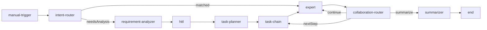

# LangGraph 对话节点 → Workflow 白盒补齐路线图

> 创建日期：**2026-07-13**  
> 角色：产品经理 + 架构  
> 关联：[agent-workflow.md](../agent-workflow.md) · [design/runtime.md](../design/runtime.md) · [backlog.md](./backlog.md)

---

## 一、背景与目标

### 1.1 现状

平台存在两条并行执行路径：

| 路径 | 入口 | 编排形态 |
|------|------|----------|
| **黑盒** Chat LangGraph | 对话未绑定已发布编排 | `graph.ts` 内编译的状态图，用户不可见 |
| **白盒** Agent Workflow | 设计器 / Webhook / invoke / Chat 选编排 | n8n 风格 DAG，节点可拖拽配置 |

二者共用 **插件 Registry**（专家、工具、MCP），但 LangGraph 的「对话智能层」——路由、需求分析、任务规划、任务链、协作切换、多步总结——**尚未**映射为 Workflow 节点。用户无法用画布复刻接近 Chat 默认体验的多 Agent 流水线。

### 1.2 产品目标

1. **能力对齐**：将 Chat LangGraph 中缺失的 6 类核心节点，以白盒节点形式纳入 Workflow 设计器。
2. **逻辑复用**：从 `server/src/ai/graph/` 抽取可共享运行时，Chat 与 Workflow **同一套业务实现**，避免双份维护。
3. **渐进交付**：按价值与复杂度分 4 个 Phase 落地，每 Phase 可独立发布、可验收。
4. **可观测一致**：Workflow 执行时推送与 Chat 对齐的结构化事件（任务链步骤、需求确认、总结流式等）。

### 1.3 明确不做（本 Phase 范围外）

| 项 | 原因 |
|----|------|
| 用 Workflow **完全替代** Chat LangGraph 默认路径 | Chat 仍需零配置开箱即用；白盒是可选增强 |
| 在画布上 1:1 还原 LangGraph **条件边**（`afterAgent` / `afterToolsRoute`） | 用「协作路由」节点 + `if` + 连线表达，不暴露图编译细节 |
| Workflow 内嵌完整 LangGraph StateGraph 子图 | 违背 DAG 心智；采用「节点内闭环 + 结构化 I/O」 |
| 修改 `server/` 以外项目实现本路线图 | 遵守项目隔离；前端仅改 `ai/app` + `ai/shared` |

---

## 二、缺口矩阵（LangGraph ↔ Workflow）

| LangGraph 节点 | 当前 Workflow 对应 | 缺口等级 | 计划节点类型 |
|----------------|---------------------|----------|--------------|
| `router` | `agent-intent`（单意图）+ `if`（手填条件） | **高** | `intent-router` |
| `requirementAnalyzer` | 无 | **高** | `requirement-analyzer` |
| `requirementConfirm` | `hitl`（结构已对齐，缺上游自动出题） | **中** | 增强 `hitl` + 接 `requirement-analyzer` 输出 |
| `taskPlanner` | 无 | **高** | `task-planner` |
| `taskChain` | 无（无法表达动态步骤推进） | **高** | `task-chain` |
| `afterTools` | 无 | **中** | `collaboration-router` |
| `summarizer` | `llm`（需手写 Prompt，无任务链上下文） | **中** | `summarizer` |
| `pluginExpert` | `expert` / `agent-intent` | ✅ 已有 | — |
| `allTools` | `tool` | ✅ 已有 | — |

---

## 三、架构原则

### 3.1 共享运行时层（新建）

从现有图节点抽出纯函数/服务，供 Chat 图与 Workflow 执行器共同调用：

```
server/src/ai/runtime/
  ├── intentRouter.ts          ← graph.ts routerNode + resolveRoutedExpert
  ├── requirementAnalyzer.ts   ← graph/requirementAnalyzer.ts
  ├── taskPlanner.ts           ← graph/taskPlanner.ts
  ├── taskChain.ts             ← graph.ts taskChainNode
  ├── collaborationRouter.ts ← graph.ts afterToolsNode + afterToolsRoute
  └── summarizer.ts            ← graph.ts summarizerNode
```

**约束**：

- Chat `graph.ts` 节点实现改为薄包装，调用 `runtime/*`。
- `agentWorkflowExecutor.ts` 新增 `case` 时只调 `runtime/*`，不复制 Prompt。
- 类型定义优先放入 `@schema-platform/ai-shared`（节点 data、输出 schema、事件名）。

### 3.2 Workflow 执行上下文扩展

任务链类节点需要在**单次 execution** 上持久化状态：

```typescript
// ai/shared/agentWorkflow.ts（示意）
interface AgentWorkflowExecutionContext {
  taskChain?: {
    steps: TaskPlanStep[]
    currentStepIndex: number
    collaborationHistory: CollaborationRecord[]
  }
  requirementAnalysis?: RequirementAnalysis
  routedExpertId?: string
}
```

- 存于 `AgentWorkflowExecution` 文档（MongoDB），`task-chain` / `collaboration-router` 读写。
- Chat LangGraph 仍用 checkpoint；Workflow 用 execution 字段，**不共用 checkpointer**。

### 3.3 节点 I/O 约定

| 节点 | 主要输入 | 主要输出 |
|------|----------|----------|
| `intent-router` | `$input.message`、`contextSource?` | `{ expertId, legacyAgentKey, chainPreview?, routeReason }` |
| `requirement-analyzer` | `$input.message`、可选 RAG | `RequirementAnalysis`（与 Chat 同结构） |
| `task-planner` | `RequirementAnalysis` 或 `$input.message` | `{ chain, strategy }` |
| `task-chain` | `chain`（来自 planner 或配置） | 当前步 `{ step, expertId, status }`；完成时 `{ done: true }` |
| `collaboration-router` | 上游 expert/tool 的 `collaborationRequest` | `{ next: 'expert' \| 'task-chain' \| 'summarizer', targetExpertId? }` |
| `summarizer` | `taskChain` 或 `$node.*` 步骤结果 | `{ content }` 流式 |

---

## 四、节点规格（产品 + 技术）

### 4.1 `intent-router`（意图路由）

**Palette 分类**：`logic`  
**对标**：`graph.ts` `routerNode` + `resolveRoutedExpert`

| 配置字段 | 类型 | 说明 |
|----------|------|------|
| `routingMode` | `auto` \| `explicit` | `explicit` 时读 `contextSource`（editor/flow/page） |
| `enableMultiIntentChain` | boolean | 是否启用「页面+表单」等多意图预建链（默认 true） |
| `fallbackExpertId` | string? | 无匹配时专家，默认 `platform.general` |

**出边**（可选，Phase J-2）：

- `matched` → 命中专家
- `needsAnalysis` → 需深度分析（连 `requirement-analyzer`）
- `general` → 通用问答

**验收**：与 Chat 同句「帮我做一个订单列表和录入表单」输出相同 `chainPreview`（单测对齐 `routerNode`）。

---

### 4.2 `requirement-analyzer`（需求分析）

**Palette 分类**：`ai`  
**对标**：`graph/requirementAnalyzer.ts`

| 配置字段 | 类型 | 说明 |
|----------|------|------|
| `enableRag` | boolean | 是否先调 `rag__search`（默认 true） |
| `enableTools` | boolean | 是否允许分析阶段调 Registry 工具 |
| `completenessThreshold` | number | 低于此分（默认 80）标记 `needsConfirm` |
| `model` | string | 默认 `default` |

**输出**：`RequirementAnalysis`（intent、entities、completeness、confirmQuestions、recommendedExperts）。

**验收**：输出 JSON schema 与 Chat `requirementAnalyzer` 事件 payload 一致。

---

### 4.3 `hitl` 增强（非新节点）

**对标**：`requirementConfirmNode`

| 增强项 | 说明 |
|--------|------|
| `questionSource` | `static` \| `upstream`（默认 upstream） |
| `upstreamField` | 从 `requirement-analyzer` 输出取 `confirmQuestions` |
| 事件 | 执行记录推送 `workflow:requirement_confirm`（对齐 Chat `requirement_confirm`） |

**验收**：`requirement-analyzer` → `hitl` → `task-planner` 链路在设计器测试可跑通。

---

### 4.4 `task-planner`（任务规划）

**Palette 分类**：`ai`  
**对标**：`graph/taskPlanner.ts`

| 配置字段 | 类型 | 说明 |
|----------|------|------|
| `inputSource` | `message` \| `requirementAnalysis` | 输入来源 |
| `maxSteps` | number | 步骤上限（默认 8） |
| `strategy` | `sequential` \| `mixed` | 执行策略提示 |
| `model` | string | 规划用模型 |

**输出**：`{ chain: TaskPlanStep[], strategy }`，写入 `execution.context.taskChain`。

**验收**：复杂需求拆解为 ≥2 步，每步 `agent` 为合法 `legacyAgentKey` 或 `expertId`。

---

### 4.5 `task-chain`（任务链推进）

**Palette 分类**：`logic`  
**对标**：`graph.ts` `taskChainNode`

**设计要点**：DAG 无环，但任务链是**动态循环**；本节点在**单次执行内**循环推进，对外表现为一个节点多次 `workflow:event`（子步骤）。

| 配置字段 | 类型 | 说明 |
|----------|------|------|
| `chainSource` | `upstream` \| `static` | 来自 planner 或手配 JSON |
| `staticChain` | TaskPlanStep[]? | 手配模式 |
| `onStepOutput` | `expert` 节点 id | 每步完成后调用的专家节点（子执行） |

**执行模型（J-3）**：

```
task-chain 节点启动
  → 取 currentStep → 调用下游 expert（通过内部 dispatch，非画布边）
  → 步完成 → currentStepIndex++
  → 直至 done → 输出汇总上下文给 summarizer
```

**验收**：2 步链（page → editor）在设计器测试完成；协作插入不死循环（对齐 `collaborationHistory` 去重）。

---

### 4.6 `collaboration-router`（协作路由）

**Palette 分类**：`logic`  
**对标**：`afterToolsNode` + `afterToolsRoute`

| 配置字段 | 类型 | 说明 |
|----------|------|------|
| `detectCollaborationTool` | boolean | 解析 `request_collaboration` 工具结果 |
| `maxCollaborationRounds` | number | 防循环（默认 3） |

**出边**：

- `continue` → 回到 `expert` / `task-chain`
- `nextStep` → `task-chain`
- `summarize` → `summarizer`

**验收**：专家 tool 返回协作请求时，正确插入步骤或跳转总结。

---

### 4.7 `summarizer`（多步总结）

**Palette 分类**：`ai`  
**对标**：`graph.ts` `summarizerNode`

| 配置字段 | 类型 | 说明 |
|----------|------|------|
| `summarySource` | `taskChain` \| `custom` | 默认从 execution.context 读已完成步骤 |
| `customPrompt` | string? | 追加说明 |
| `stream` | boolean | 是否流式（Chat trigger 默认 true） |
| `model` | string | 总结模型 |

**验收**：多步执行后输出与 Chat `summarizer` 语义一致（含后续建议）；支持 `workflow:stream` 增量推送。

---

## 五、分阶段实施计划（Phase J）

### 总览

| 阶段 | 主题 | 优先级 | 预估 | 交付物 |
|------|------|--------|------|--------|
| **J-0** | 共享运行时抽取 | P0 | 3d | `server/src/ai/runtime/*` + Chat 回归 |
| **J-1** | 高价值单节点 | P0 | 4d | `intent-router`、`summarizer` |
| **J-2** | 需求分析链路 | P1 | 5d | `requirement-analyzer` + `hitl` 增强 |
| **J-3** | 任务链闭环 | P1 | 8d | `task-planner`、`task-chain`、`collaboration-router` |
| **J-4** | 模板与文档 | P1 | 3d | 官方模板 + 术语表更新 |

---

### J-0 — 共享运行时抽取

| ID | 任务 | 文件 |
|----|------|------|
| J-0-1 | 新建 `runtime/intentRouter.ts`，迁移 router 逻辑 | `server/src/ai/runtime/` |
| J-0-2 | 迁移 `requirementAnalyzer`、`taskPlanner`、`summarizer` | 同上 |
| J-0-3 | `graph.ts` 改为调用 runtime；`server` vitest 全绿 | `graph/*.ts` |
| J-0-4 | 导出 `RequirementAnalysis`、`TaskPlanStep` 到 `ai-shared` | `ai/shared/` |

**完成标准**：Chat 行为零回归；runtime 函数可被 executor 单独 import。

---

### J-1 — 意图路由 + 总结

| ID | 任务 | 文件 |
|----|------|------|
| J-1-1 | `AgentNodeType` 增加 `intent-router`、`summarizer` | `ai/shared/agentWorkflow.ts` |
| J-1-2 | Palette + 属性面板 | `agentNodes.ts`、`*NodePanel.vue` |
| J-1-3 | Executor `case` + 单测 | `agentWorkflowExecutor.ts` |
| J-1-4 | `workflow:event` 增加 `route_decided`、`summary_stream` | `ai-shared` events |
| J-1-5 | 设计器校验：router 后建议接 expert 或 analyzer | `validateAgentWorkflowGraph` |

**完成标准**：模板「智能助手 v2」可用手动链 `intent-router → expert → summarizer` 跑通。

---

### J-2 — 需求分析链路

| ID | 任务 | 文件 |
|----|------|------|
| J-2-1 | 节点 `requirement-analyzer` 全栈 | shared + executor + panel |
| J-2-2 | `hitl` 增加 `questionSource: upstream` | `AgentWorkflowNodeData`、HitlNodePanel |
| J-2-3 | 图校验：analyzer → hitl 类型提示 | designer store |
| J-2-4 | Chat 对齐事件 `workflow:requirement_confirm` | WebSocket handler |

**完成标准**：中等复杂度需求触发确认卡片，用户回复后继续下游。

---

### J-3 — 任务链闭环

| ID | 任务 | 文件 |
|----|------|------|
| J-3-1 | `execution.context` 持久化 taskChain | `agentWorkflow` model |
| J-3-2 | 节点 `task-planner` | 全栈 |
| J-3-3 | 节点 `task-chain`（内循环 + 子步骤事件） | executor 核心 |
| J-3-4 | 节点 `collaboration-router` | 全栈 |
| J-3-5 | 与 `expert`/`tool` 组合的集成测 | vitest + 设计器 e2e |

**完成标准**：复刻「列表页 + 表单」双步链；工具触发协作时不死循环。

---

### J-4 — 模板与产品包装

| ID | 任务 | 说明 |
|----|------|------|
| J-4-1 | 模板 `chat-parity-assistant` | 接近 Chat 默认链路的官方 DAG |
| J-4-2 | 模板 `requirement-gated-build` | 分析 → 确认 → 规划 → 执行 |
| J-4-3 | 更新 [agent-workflow.md](../agent-workflow.md) §2 节点表 | 文档 |
| J-4-4 | 更新 [workflow-terminology.md](./workflow-terminology.md) | 新节点中文名 |
| J-4-5 | seed `demo-chat-parity` 已发布流 | `seedDemoWorkflows.ts` |

---

## 六、推荐画布拓扑（目标态）

### 6.1 接近 Chat 默认（`chat-parity-assistant`）



### 6.2 轻量自动化（无任务链）

```
webhook-trigger → intent-router → expert → summarizer → end
```

---

## 七、前端改动清单

| 模块 | 改动 |
|------|------|
| `ai/shared/agentWorkflow.ts` | 新 `AgentNodeType`、节点 data 接口、校验规则 |
| `ai/app/src/constants/agentNodes.ts` | Palette 6 项 + 分类 `conversation`（新分类，可选） |
| `ai/app/src/components/workflow/panels/` | `IntentRouterNodePanel.vue` 等 6 个 |
| `ai/app/src/components/workflow/nodes/` | 画布节点样式与图标 |
| `ai/app/src/stores/agentWorkflowDesigner.ts` | 连线建议、非法组合警告 |
| `ai/app/src/composables/useWorkflowChatExecution.ts` | 新事件类型展示（任务链时间线） |
| `ai/app/src/components/chat/` | 可选：Workflow 任务链 UI 复用 Chat `taskChain` 组件 |

---

## 八、测试与验收

| 层级 | 要求 |
|------|------|
| 单测 | 每个 `runtime/*` 与 graph 原实现 fixture 对齐 |
| Executor | 每节点 ≥2 用例（成功 / 缺参失败） |
| 回归 | `server/src/ai` + `ai/app` vitest 不下降 |
| 手工 | 设计器测试 + Chat 绑定编排各跑一条「列表+表单」需求 |
| 对齐 | 同一输入，Chat 黑盒 vs `demo-chat-parity` 白盒，专家选择与步数一致率 ≥90%（允许 Prompt 波动） |

---

## 九、风险与缓解

| 风险 | 缓解 |
|------|------|
| `task-chain` 在 DAG 中语义难懂 | 节点内闭环 + 子步骤时间线 UI；文档配图 |
| 双路径逻辑漂移 | J-0 强制 runtime 单实现；CI 对比测试 |
| 执行记录膨胀 | `task-chain` 子步骤写入 `nodeRecords` 子数组，可配置压缩 |
| 画布过于复杂 | 官方模板一键创建；Palette 新分类「对话智能」折叠 |

---

## 十、全量任务索引

| ID | 说明 | Phase | 优先级 |
|----|------|-------|--------|
| J-0-1 | runtime `intentRouter` | J-0 | P0 |
| J-0-2 | runtime analyzer / planner / summarizer | J-0 | P0 |
| J-0-3 | graph.ts 薄包装 + 回归 | J-0 | P0 |
| J-0-4 | ai-shared 类型导出 | J-0 | P0 |
| J-1-1 | 类型 `intent-router`、`summarizer` | J-1 | P0 |
| J-1-2 | Palette + Panels | J-1 | P0 |
| J-1-3 | Executor cases | J-1 | P0 |
| J-1-4 | 事件 `route_decided`、`summary_stream` | J-1 | P1 |
| J-1-5 | 图校验规则 | J-1 | P2 |
| J-2-1 | 节点 `requirement-analyzer` | J-2 | P1 |
| J-2-2 | `hitl` upstream 问题 | J-2 | P1 |
| J-2-3 | 设计器链路提示 | J-2 | P2 |
| J-2-4 | WS `requirement_confirm` | J-2 | P1 |
| J-3-1 | execution.context.taskChain | J-3 | P0 |
| J-3-2 | 节点 `task-planner` | J-3 | P1 |
| J-3-3 | 节点 `task-chain` | J-3 | P0 |
| J-3-4 | 节点 `collaboration-router` | J-3 | P1 |
| J-3-5 | 集成测试 | J-3 | P1 |
| J-4-1 | 模板 `chat-parity-assistant` | J-4 | P1 |
| J-4-2 | 模板 `requirement-gated-build` | J-4 | P2 |
| J-4-3 | agent-workflow 文档 | J-4 | P1 |
| J-4-4 | workflow-terminology | J-4 | P2 |
| J-4-5 | seed `demo-chat-parity` | J-4 | P1 |

---

## 十一、排期示意（约 4 周）

```
Week 1: J-0 全流程 + J-1 intent-router / summarizer
Week 2: J-2 requirement-analyzer + hitl 增强
Week 3: J-3 task-planner + task-chain（核心）
Week 4: J-3 collaboration-router + J-4 模板与 seed
```

---

**最后更新**：2026-07-13
